# Aether — System Architecture

> [!NOTE]
> **Portfolio Repository** — This document describes the technical architecture of the Aether Litigation Intelligence Platform. This is a **documentation-only repository** — the production application is privately hosted.

> AI-assisted litigation intelligence platform. Case briefing, adversarial analysis, draft generation, and preparation tools — built for speed. All AI output requires attorney review.

---

## Table of Contents

1. [System Overview](#system-overview)
2. [Intelligence Architecture](#intelligence-architecture)
3. [AI Engine Architecture](#ai-engine-architecture)
4. [RAG Pipeline](#rag-pipeline)
5. [Conversation Memory](#conversation-memory)
6. [Document Processing Pipeline](#document-processing-pipeline)
7. [Data Model](#data-model)
8. [API Surface](#api-surface)
9. [Request Lifecycle](#request-lifecycle)
10. [Security Model](#security-model)
11. [Jurisdiction Engine](#jurisdiction-engine)
12. [Testing](#testing)
13. [Deployment](#deployment)
14. [Design Decisions](#design-decisions)

---

## System Overview

Aether is a full-stack litigation intelligence platform designed to turn raw case data (pleadings, depositions, discovery productions, expert reports) into structured, AI-generated analysis for attorney review. The system runs as a containerized service within a homelab infrastructure behind an identity proxy.

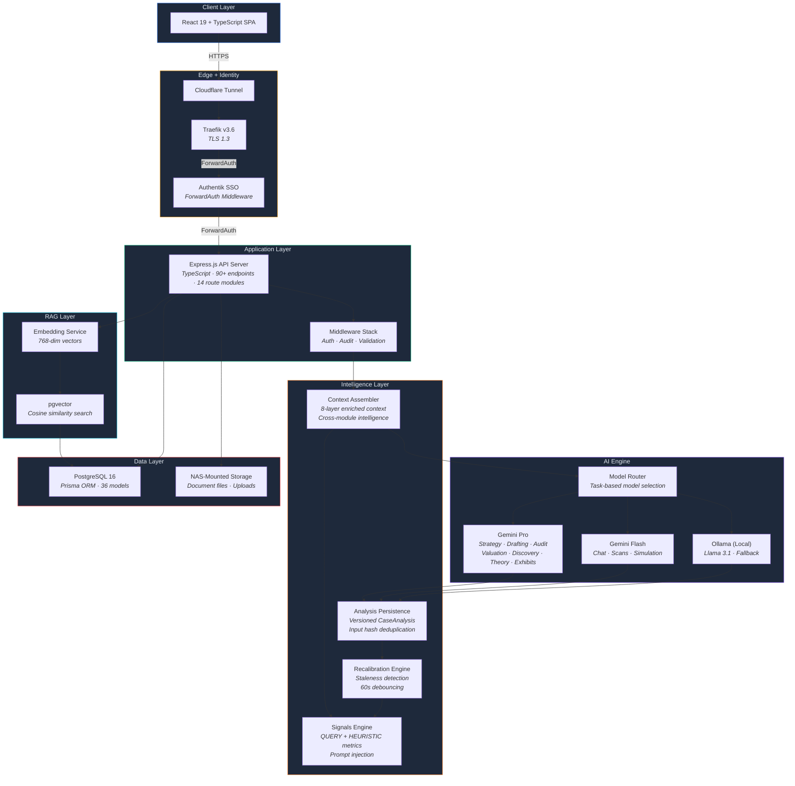

---

## Intelligence Architecture

The intelligence layer persists, versions, and interconnects all AI module outputs. Every analysis is stored as a `CaseAnalysis` record with full version chains, input hashing for deduplication, and signal snapshots for staleness detection.

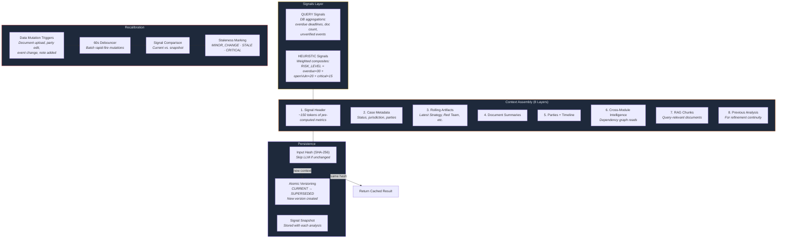

### Cross-Module Dependencies

Each AI module reads from other modules' latest outputs to build enriched context:

| Module | Reads From |
|--------|-----------|
| **Strategy** | Red Team, Valuation, Discovery |
| **Red Team** | Strategy, Discovery |
| **Discovery** | Strategy, Red Team |
| **Valuation** | Strategy, Red Team, Discovery |
| **Draft** | Strategy, Red Team, Discovery, Valuation |
| **Case Theory Map** | Strategy, Red Team, Discovery |
| **Key Exhibits** | Strategy, Red Team, Case Theory Map |
| **Privilege Scan** | (standalone — no cross-module reads) |
| **Citation Check** | (standalone — no cross-module reads) |
| **Playbook Execution** | Strategy, Red Team, Discovery (via case data + signals) |

### Analysis Lifecycle Service

Shared helpers that centralize lifecycle patterns across all AI modules:

- **`runAnalysisModule()`** — Full lifecycle: enriched context → dedup check → LLM call → output validation → persist → recalibrate
- **`runRefinement()`** — Refinement variant: loads previous analysis, appends feedback, runs LLM, persists new version
- **`buildAnalysisMeta()`** — Constructs response metadata (analysis ID, version, staleness, model info)
- **`getSignalsSnapshot()`** / **`getModelName()`** — Shared utilities

### Knowledge Graph

A lightweight directed graph (`GraphEdge` table) connects case entities with typed relationships. AI modules write edges during analysis; other modules query them for enriched context.

| Edge Type | Meaning |
|-----------|---------|
| SUPPORTS | Entity A provides evidence for Entity B |
| CONTRADICTS | Entity A conflicts with Entity B |
| MENTIONS | Entity A references Entity B |
| DERIVED_FROM | Entity A was generated based on Entity B |

---

## AI Engine Architecture

The AI layer uses **task-based model routing** — each request type maps to the optimal model for that task. Complex reasoning routes to the most capable model. Lighter tasks route to a faster model. Local Ollama provides an always-available fallback.

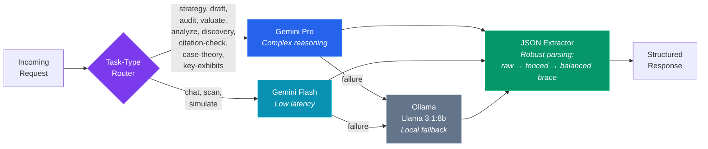

### Cognitive Core

All AI agents share a unified **Cognitive Protocol** — a structured reasoning framework that enforces analytical rigor:

| Protocol | Function |
|----------|----------|
| Elemental Analysis | Break claims into elements, check satisfaction |
| Adversarial Reasoning | Predict opponent's next 3 moves |
| Strategy Sequencing | Sequence actions for momentum |
| Risk Intelligence | Measure procedural, evidentiary, narrative risk |
| Narrative Construction | Find the emotional anchor |
| Contradiction Detector | Spot inconsistencies in testimony/evidence |
| Precedent Mapping | Identify controlling precedent |
| Procedural Exploitation | Find missed deadlines, waived objections |
| Leverage Calibration | Calculate BATNA, settlement corridor |
| Evidence Chain | Map chain of custody, find weak links |
| Credibility Assessment | Evaluate witness reliability |
| Exit Strategy | Calculate settlement ranges |

Each AI module inherits these protocols and applies them through specialized system instructions with jurisdiction-aware constraints.

### Rate Limiting & Graceful Degradation

All Gemini API calls are throttled by a service-level rate limiter (not middleware) with sliding-window tracking and FIFO wait queues:

| Model | RPM | TPM | RPD |
|-------|-----|-----|-----|
| Gemini Pro | 25 | 1,000,000 | 250 |
| Gemini Flash | 2,000 | 4,000,000 | Unlimited |
| Embedding 001 | 3,000 | 1,000,000 | Unlimited |

Interactive requests wait up to 5 seconds then gracefully fall back to Ollama. Background document processing waits up to 120 seconds. The health endpoint exposes live RPM/TPM/RPD usage and queue depth per tier.

### LLM Output Validation

All AI module outputs are validated against Zod schemas before persistence. Schemas are intentionally lenient (most fields optional) since LLM output is non-deterministic — the goal is catching structurally broken responses. If validation fails, the raw output is stored and the analysis is marked FAILED.

---

## RAG Pipeline

Documents are processed into vector embeddings for semantic retrieval, ensuring AI responses are grounded in actual case evidence.

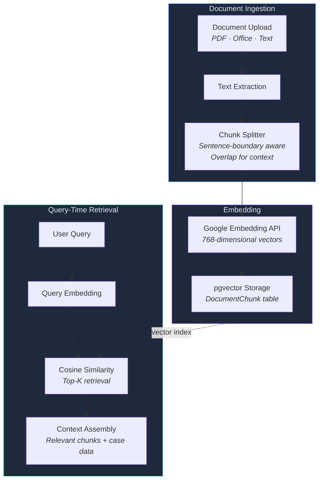

---

## Conversation Memory

The Case Chat Assistant maintains persistent memory across sessions using a hybrid approach:

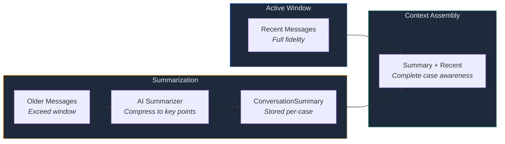

---

## Document Processing Pipeline

Every document upload triggers an asynchronous processing pipeline with tracked job lifecycle. On completion, the recalibration engine is notified to check for stale analyses.

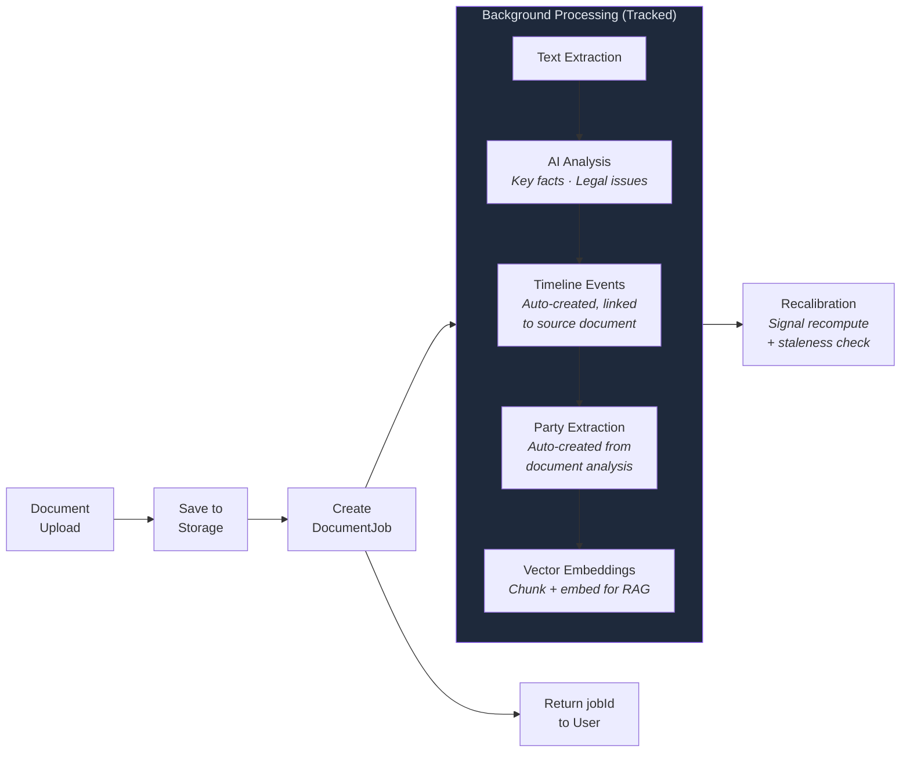

---

## Data Model

Multi-tenant architecture with firm-level data isolation, vector search, conversation memory, intelligence persistence with versioned analyses, signal computation, knowledge graph, litigation playbooks, managing-partner workflows (portfolio, tasks, discovery orchestration, motion practice), evidence tracking, and action audit logging. 36 Prisma models across 13 migrations.

<strong>View complete data model diagram</strong> — 36 Prisma models with relationships

 

```mermaid
erDiagram
    FIRM ||--o{ USER : "has members"
    FIRM ||--o{ CASE : "owns"
    USER ||--o{ CASE : "manages"
    CASE ||--o{ DOCUMENT : "contains"
    CASE ||--o{ PARTY : "involves"
    CASE ||--o{ EVENT : "tracks"
    CASE ||--o{ NOTE : "stores"
    CASE ||--o{ CHAT_MESSAGE : "logs"
    CASE ||--o{ CONVERSATION_SUMMARY : "summarizes"
    CASE ||--o{ CASE_ANALYSIS : "analyzes"
    CASE ||--o{ CASE_SIGNAL : "measures"
    CASE ||--o{ CASE_EVENT_LOG : "audits"
    CASE ||--o{ GRAPH_EDGE : "connects"
    CASE ||--o{ ANALYSIS_JOB : "queues"
    CASE ||--o{ SIMULATION_SESSION : "simulates"
    CASE ||--o{ CITATION_RECORD : "verifies"
    CASE ||--o{ PLAYBOOK_EXECUTION : "executes"
    CASE ||--o{ TASK : "assigns"
    CASE ||--o{ SCHEDULING_DEADLINE : "schedules"
    CASE ||--o| DISCOVERY_POSTURE : "tracks posture"
    CASE ||--o{ DISCOVERY_PACKET : "tracks packets"
    CASE ||--o{ MOTION : "files"
    CASE ||--o{ EXPERT : "retains"
    CASE ||--o| SETTLEMENT_POSTURE : "negotiates"
    DOCUMENT ||--o{ DOCUMENT_CHUNK : "embedded as"
    DOCUMENT ||--o{ DOCUMENT_TAG : "tagged with"
    DOCUMENT ||--o{ DOCUMENT_JOB : "tracked by"
    DOCUMENT ||--o{ EVIDENCE_SPAN : "spans"
    DOCUMENT ||--o{ EVENT : "source of"
    CASE_ANALYSIS ||--o{ STRATEGIC_PRIORITY : "produces"
    CASE_ANALYSIS ||--o{ VULNERABILITY : "identifies"
    CASE_ANALYSIS ||--o{ DISCOVERY_REQUEST : "generates"
    CASE_ANALYSIS ||--o{ LEGAL_DRAFT : "drafts"
    CASE_ANALYSIS ||--o{ ANALYSIS_PATCH : "patched by"
    CASE_ANALYSIS ||--o{ CITATION_RECORD : "cites"
    CASE_ANALYSIS ||--o| CASE_ANALYSIS : "supersedes"
    FIRM ||--o{ PLAYBOOK : "owns"
    PLAYBOOK ||--o{ PLAYBOOK_EXECUTION : "runs"
    TASK ||--o{ TASK_LINK : "links to"
    LEGAL_DRAFT ||--o{ MOTION : "supports"

    FIRM {
        uuid id PK
        string name
        timestamp createdAt
    }

    USER {
        uuid id PK
        string authentikUid UK
        string email UK
        string name
        enum role "ADMIN | MEMBER | VIEWER"
        uuid firmId FK
    }

    CASE {
        uuid id PK
        string title
        string caseNumber
        text summary
        string caseType
        string status
        string jurisdiction
        string court
        string judge
        timestamp archivedAt "nullable"
        uuid userId FK
        uuid firmId FK
    }

    CASE_ANALYSIS {
        uuid id PK
        uuid caseId FK
        enum moduleType "STRATEGY | RED_TEAM | DISCOVERY | etc."
        boolean isRolling
        int version
        enum status "CURRENT | STALE | SUPERSEDED | ARCHIVED"
        enum stalenessLevel "FRESH | MINOR_CHANGE | STALE | CRITICAL"
        text staleReason
        json output
        text summary
        string inputHash "SHA-256 for deduplication"
        text inputSnapshot
        json signalsSnapshot "For staleness comparison"
        enum triggerType "MANUAL | AUTO_RECALIBRATION | CASCADE | REFINEMENT"
        uuid parentId FK "Version chain"
        text focusArea
        text feedback
        string generatedBy
        string promptVersion
        json confidence
        json knownGaps
        float modelTemperature
        int modelSeed
        int tokensUsed
    }

    CASE_SIGNAL {
        uuid id PK
        uuid caseId FK
        string key UK
        json valueJson
        string displayValue
        text explanation
        enum computeMethod "QUERY | HEURISTIC | LLM"
    }

    GRAPH_EDGE {
        uuid id PK
        uuid caseId FK
        string sourceNodeType
        string sourceNodeId
        string edgeType "SUPPORTS | CONTRADICTS | MENTIONS"
        string targetNodeType
        string targetNodeId
        float confidence
    }

    STRATEGIC_PRIORITY {
        uuid id PK
        uuid caseId FK
        uuid analysisId FK
        string title
        text rationale
        text requiredEvidence
        int sequenceOrder
        enum status "PLANNED | IN_PROGRESS | EXECUTED | ABANDONED"
    }

    VULNERABILITY {
        uuid id PK
        uuid caseId FK
        uuid analysisId FK
        string title
        enum severity "CRITICAL | HIGH | MODERATE | LOW"
        string category
        text attackVector
        text recommendedDefense
        enum status "OPEN | MITIGATED | ACCEPTED | RESOLVED"
    }

    DISCOVERY_REQUEST {
        uuid id PK
        uuid caseId FK
        uuid analysisId FK
        enum requestType "INTERROGATORY | RFP | RFA"
        int sequenceNumber
        text content
        enum status "DRAFT | APPROVED | SENT | etc."
    }

    LEGAL_DRAFT {
        uuid id PK
        uuid caseId FK
        uuid analysisId FK
        string documentType
        string title
        text content
        int version
        enum status "DRAFT | REVIEWED | FINALIZED | FILED"
    }

    DOCUMENT {
        uuid id PK
        string title
        string fileName
        string mimeType
        int size
        string storagePath
        string category
        text summary
        uuid caseId FK
    }

    DOCUMENT_CHUNK {
        uuid id PK
        text content
        vector embedding "768 dimensions"
        int chunkIndex
        uuid documentId FK
    }

    DOCUMENT_TAG {
        uuid id PK
        string name
        string color
        uuid documentId FK
    }

    PARTY {
        uuid id PK
        string name
        string role
        text description
        string contact
        uuid caseId FK
    }

    EVENT {
        uuid id PK
        string title
        datetime date
        string type
        text description
        boolean isVerified
        boolean isDeadline
        float confidence "nullable"
        json sources "evidence source references"
        text extractedText "nullable"
        uuid caseId FK
        uuid sourceDocumentId FK "nullable"
    }

    SIMULATION_SESSION {
        uuid id PK
        uuid caseId FK
        enum simulationType "HEARING | DEPOSITION"
        string persona
        json transcript
        json coachingNotes
    }

    CITATION_RECORD {
        uuid id PK
        uuid caseId FK
        uuid analysisId FK "nullable"
        uuid draftId FK "nullable"
        uuid sourceDocumentId FK "nullable"
        uuid evidenceSpanId FK "nullable"
        string citation
        enum status "VERIFIED | SUSPICIOUS | LIKELY_FABRICATED | USER_CONFIRMED"
        float confidence
        string_array usedIn
        string extractedFrom "nullable"
        boolean jurisdictionScoped
        datetime verifiedAt
    }

    EVIDENCE_SPAN {
        uuid id PK
        uuid documentId FK
        uuid chunkId FK "nullable"
        text content
        int pageNumber "nullable"
        int startOffset "nullable"
        int endOffset "nullable"
        float confidence
        string extractedBy "nullable"
    }

    PLAYBOOK {
        uuid id PK
        string name
        enum type "PROCEDURAL | EVIDENCE | DISCOVERY | HEARING_PREP | RED_TEAM"
        text description
        string version
        json config "triggers, rules, outputs, thresholds"
        boolean isActive
        uuid firmId FK
    }

    PLAYBOOK_EXECUTION {
        uuid id PK
        uuid playbookId FK
        uuid caseId FK
        enum status "PENDING | RUNNING | COMPLETED | FAILED"
        json inputs
        json outputs
        string triggeredBy
    }

    TASK {
        uuid id PK
        uuid caseId FK
        string title
        text description
        enum status "OPEN | IN_PROGRESS | DONE | CANCELLED"
        int priority "1-5"
        datetime dueDate "nullable"
        uuid ownerUserId FK "nullable"
        enum sourceModule "nullable"
    }

    TASK_LINK {
        uuid id PK
        uuid taskId FK
        string linkType "EVENT | DOCUMENT | DRAFT | etc."
        string linkId
    }

    SCHEDULING_DEADLINE {
        uuid id PK
        uuid caseId FK
        string name
        datetime date
        enum category "DISCOVERY | EXPERT | MOTIONS | MEDIATION | TRIAL | PRETRIAL"
        boolean isCritical
        enum confidence "HIGH | MEDIUM | LOW"
    }

    DISCOVERY_POSTURE {
        uuid id PK
        uuid caseId FK "unique"
        enum status "NOT_STARTED | IN_PROGRESS | DISPUTE | COMPLETE"
        datetime lastOutgoingDate
        datetime lastIncomingDate
        int openDisputesCount
    }

    DISCOVERY_PACKET {
        uuid id PK
        uuid caseId FK
        enum packetType "OUTGOING | INCOMING"
        enum subtype "RFP | ROG | RFA | RESPONSE | PRODUCTION"
        datetime servedDate
        datetime dueDate
        enum status "DRAFT | SERVED | RECEIVED | OVERDUE | DEFICIENT | CURED"
    }

    MOTION {
        uuid id PK
        uuid caseId FK
        enum motionType "MTD | MSJ | MTC | MIL | EXTENSION | SANCTIONS | OTHER"
        string title
        datetime dueDate
        datetime hearingDate
        enum status "PLANNED | DRAFTING | FILED | HEARD | GRANTED | DENIED | MOOT"
        uuid linkedDraftId FK "nullable"
    }

    EXPERT {
        uuid id PK
        uuid caseId FK
        string name
        string specialty
        enum retainedBy "PLAINTIFF | DEFENDANT | COURT"
        datetime reportDue
        enum daubertStatus "NONE | CHALLENGED | UPHELD | EXCLUDED"
    }

    SETTLEMENT_POSTURE {
        uuid id PK
        uuid caseId FK "unique"
        float lastDemand
        float lastOffer
        datetime mediationDate
        enum status "UNKNOWN | PRE_MEDIATION | IN_MEDIATION | POST_MEDIATION | SETTLED | IMPASSE"
    }

    ANALYSIS_JOB {
        uuid id PK
        uuid caseId FK
        enum moduleType
        enum status "QUEUED | PROCESSING | COMPLETED | FAILED"
        int priority "1-5"
        enum triggerType
    }

    CASE_EVENT_LOG {
        uuid id PK
        uuid caseId FK
        string eventType
        json payload
        string userId
        timestamp timestamp
    }

    AUDIT_LOG {
        uuid id PK
        string userId
        string action
        string resource
        string resourceId
        string ipAddress
        string userAgent
        json metadata
        timestamp timestamp
    }
```

---

## API Surface

90+ RESTful endpoints organized across 14 route modules plus 2 health endpoints. Every mutating endpoint writes to the audit log. All POST and PATCH endpoints validated via Zod schemas (36 schemas total). CRUD mutations trigger the recalibration engine to detect stale analyses.

<strong>View API surface diagram</strong> — 90+ endpoints across 14 route modules + health

 

```mermaid
flowchart TB
    subgraph AUTH["Auth — 1 endpoint"]
        A1["GET /auth/me"]
    end

    subgraph CASE_MGMT["Case Management — 25 endpoints"]
        C1["CRUD /cases<br/><i>+ archive / restore / brief</i>"]
        C2["CRUD /cases/:id/parties"]
        C3["CRUD /cases/:id/documents"]
        C4["CRUD /cases/:id/events"]
        C5["CRUD /cases/:id/notes"]
    end

    subgraph AI_INTEL["AI Intelligence — 8 endpoints"]
        I1["POST /chat<br/><i>Context-aware legal advisor<br/>+ RAG retrieval + memory</i>"]
        I2["POST /strategy<br/><i>War Room SWOT analysis</i>"]
        I3["POST /audit<br/><i>Red Team vulnerability scan</i>"]
        I4["POST /discovery<br/><i>Generate interrogatories,<br/>RFPs, RFAs</i>"]
        I5["POST /draft<br/><i>Motion & brief drafting</i>"]
        I6["POST /verify-citations<br/><i>LLM citation plausibility check</i>"]
        I7["POST /case-theory<br/><i>Claims → elements → evidence map</i>"]
        I8["POST /key-exhibits<br/><i>Exhibit analysis & prioritization</i>"]
    end

    subgraph INTEL_API["Intelligence Persistence — 21 endpoints"]
        IA1["GET /analyses<br/><i>Versioned analysis history<br/>per module</i>"]
        IA2["GET/POST /signals<br/><i>Case health metrics<br/>+ force recompute</i>"]
        IA3["GET /graph<br/><i>Knowledge graph edges<br/>with filtering</i>"]
        IA4["GET/PATCH /priorities<br/>vulnerabilities · drafts<br/>discovery-requests · citations"]
        IA5["GET /jobs · /event-log<br/>simulations"]
    end

    subgraph SIMULATION["Simulation — 3 endpoints"]
        S1["POST /simulate-hearing<br/><i>AI judge argument practice</i>"]
        S2["POST /simulate-deposition<br/><i>Hostile opposing counsel</i>"]
        S3["POST /transcribe<br/><i>Voice input via Whisper</i>"]
    end

    subgraph TOOLS["Analysis Tools — 3 endpoints"]
        T1["POST /analyze-document<br/><i>Document analysis</i>"]
        T2["POST /tools/valuate<br/><i>Settlement valuation</i>"]
        T3["POST /tools/scan<br/><i>Privilege scanner</i>"]
    end

    subgraph HEALTH["Health — 2 endpoints"]
        H1["GET /health<br/><i>Public status check</i>"]
        H2["GET /health/detailed<br/><i>Auth-required · rate limit stats</i>"]
    end

    subgraph ADMIN["Admin — 3 endpoints"]
        AD1["POST /admin/demo-mode<br/><i>Enter demo impersonation</i>"]
        AD2["POST /admin/stop-impersonate<br/><i>Exit demo mode</i>"]
        AD3["POST /admin/reset-demo<br/><i>Reset demo data</i>"]
    end

    subgraph PLAYBOOKS["Playbooks — 8 endpoints"]
        PB1["GET/POST /playbooks<br/><i>List + upload YAML playbooks</i>"]
        PB2["GET/DELETE /playbooks/:id<br/><i>Details + removal</i>"]
        PB3["POST /playbooks/:id/execute<br/><i>Run against a case</i>"]
        PB4["GET /playbooks/executions/:id<br/><i>Execution status + results</i>"]
        PB5["GET /playbooks/templates<br/><i>Built-in playbook templates</i>"]
    end

    subgraph PORTFOLIO["Portfolio — 2 endpoints"]
        PO1["GET /portfolio/triage<br/><i>Risk-ranked case list (0-100)</i>"]
        PO2["GET /portfolio/calendar<br/><i>Aggregated deadline calendar</i>"]
    end

    subgraph TASKS["Tasks — 6 endpoints"]
        TK1["GET/POST /tasks<br/><i>List + create tasks</i>"]
        TK2["PATCH/DELETE /tasks/:id<br/><i>Update + remove tasks</i>"]
        TK3["POST/DELETE /task-links<br/><i>Link tasks to entities</i>"]
    end

    subgraph DISC_MGMT["Discovery Mgmt — 4 endpoints"]
        DM1["GET/POST /discovery/packets<br/><i>Track discovery packets</i>"]
        DM2["PATCH/DELETE /discovery/packets/:id<br/><i>Update + remove packets</i>"]
    end

    subgraph MOTIONS["Motions — 4 endpoints"]
        MO1["GET/POST /motions<br/><i>List + create motions</i>"]
        MO2["PATCH/DELETE /motions/:id<br/><i>Update + remove motions</i>"]
    end

    style AUTH fill:#334155,stroke:#64748b,color:#e2e8f0
    style CASE_MGMT fill:#1e3a5f,stroke:#3b82f6,color:#e2e8f0
    style AI_INTEL fill:#3b1d6e,stroke:#8b5cf6,color:#e2e8f0
    style INTEL_API fill:#4a1d0f,stroke:#f97316,color:#e2e8f0
    style SIMULATION fill:#5b2120,stroke:#ef4444,color:#e2e8f0
    style TOOLS fill:#1a3a2a,stroke:#10b981,color:#e2e8f0
    style ADMIN fill:#164e63,stroke:#06b6d4,color:#e2e8f0
    style PLAYBOOKS fill:#4a1942,stroke:#c084fc,color:#e2e8f0
    style PORTFOLIO fill:#1e3a3a,stroke:#2dd4bf,color:#e2e8f0
    style TASKS fill:#3a2a1a,stroke:#fb923c,color:#e2e8f0
    style DISC_MGMT fill:#1a2a3a,stroke:#38bdf8,color:#e2e8f0
    style MOTIONS fill:#3a1a2a,stroke:#f472b6,color:#e2e8f0
```

### Server Configuration

- Request timeout: 120 seconds (accommodates long LLM calls)
- Keep-alive timeout: 65 seconds
- JSON body limit: 10MB (file uploads handled separately via multer)

---

## Request Lifecycle

Every request passes through the same pipeline: edge security → authentication → audit → processing. AI module requests additionally go through the intelligence layer for context assembly, deduplication, persistence, and recalibration.

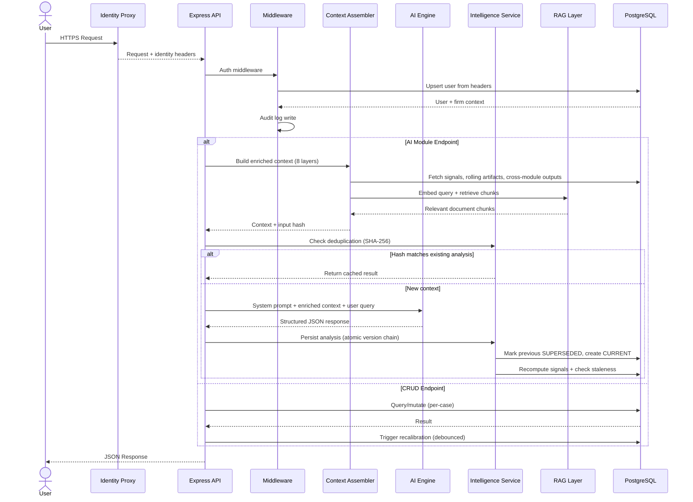

---

## Security Model

Containerized service deployed behind an identity proxy. The API is not directly exposed and trusts identity headers from the upstream proxy.

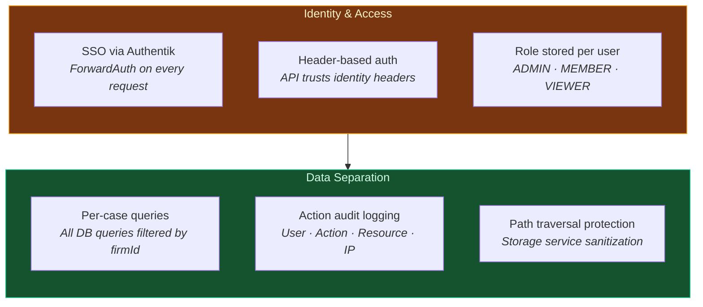

### Authentication Flow

All requests pass through Authentik SSO using Traefik ForwardAuth middleware. The API trusts identity headers (`X-authentik-uid`, `X-authentik-email`, `X-authentik-name`) from the upstream proxy. There is no application-layer cryptographic verification (no JWT, no HMAC, no mTLS).

On every authenticated request, the auth middleware upserts the user in the database, associates them with their firm (default "Personal" firm created atomically if none exists), and attaches user context to the request.

### Auth Hardening

- **Transaction-protected ADMIN promotion** — First-user ADMIN assignment wrapped in a database transaction with re-check to prevent race conditions
- **Atomic firm creation** — Default firm created via `upsert` on a deterministic ID, preventing duplicates under concurrent requests
- **Cross-tenant impersonation guard** — Admin demo mode impersonation restricted to users within the same firm
- **Firm ID enforcement** — Utility helper validates non-null firm assignment before any data access, returning 403 if missing

### Data Separation

All database queries are filtered by the authenticated user's `firmId`. No cross-firm access is possible. Document storage paths are organized by case ID with path traversal protection via `path.resolve()` validation.

### Audit Logging

Two audit systems: a system-wide `AuditLog` recording user actions (who, what, when, where) and a per-case `CaseEventLog` tracking data mutations for the recalibration engine.

### Trust Boundaries

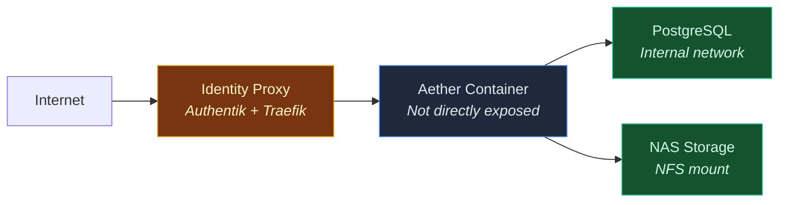

**Current limitations:**

> [!WARNING]
> - No JWT signature verification or HMAC at the application layer
> - RBAC enforcement is minimal — only case deletion checks for Admin role
> - Audit log records actions but not before/after state values
> - No verification audit trail (who verified, when)

---

## Jurisdiction Engine

Multi-jurisdiction support with configurable legal constraints per case. Each AI agent is bound to the applicable jurisdiction's statutes, procedural rules, and court conventions.

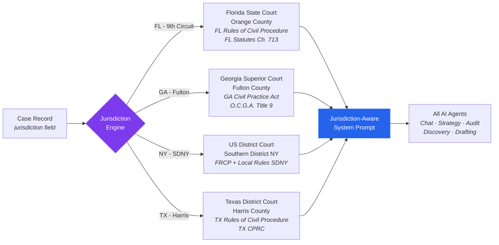

---

## Testing

Unit test suite using **vitest 4.0** with `@vitest/coverage-v8`:

| Test File | Tests | Coverage |
|-----------|-------|----------|
| extractJson | 76 | JSON parsing pipeline |
| embeddings | 43 | Chunking + embedding |
| rateLimiter | 35 | Rate limit enforcement |
| validate | 22 | Zod schema validation |
| storage | 19 | File storage operations |
| llmOutputSchemas | 17 | LLM output validation |
| auth | 16 | Auth middleware + hardening |
| analysisLifecycle | 15 | Analysis lifecycle helpers |
| playbookValidator | 14 | Playbook YAML validation |
| contextAssembler | 9 | Context assembly pipeline |
| **Total** | **266** | |

Coverage thresholds enforced at **80% line coverage** for correctness-critical services: `embeddings.ts`, `rateLimiter.ts`, `recalibration.ts`, `signals.ts`, `intelligence.ts`.

---

## Deployment

Single Docker container deployed within the Eola Gateway homelab stack.

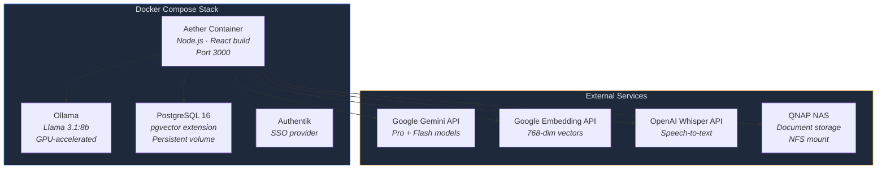

---

## Design Decisions

Key technical decisions and their rationale:

| Decision | Rationale | Trade-off |
|----------|-----------|-----------|
| **Task-based model routing** | Complex reasoning (strategy, audit) needs the most capable model; lighter tasks (chat, scans) benefit from lower latency | More routing complexity, but optimized cost-to-quality ratio |
| **Local LLM fallback** | Ensures availability during API outages; provides offline capability | Requires GPU resources; output quality may differ from primary models |
| **Input hash deduplication** | Prevents token waste on unchanged inputs; instant response for repeated queries | Additional DB lookup per request; cache invalidation complexity |
| **Versioned analysis persistence** | Enables historical comparison; full audit trail of how analysis evolved | Storage growth over time; more complex "latest" queries |
| **Prisma ORM** | Type-safe database access; schema migration tooling; generated types | Additional abstraction layer; less query optimization control |
| **pgvector over dedicated vector DB** | Keeps all data in one system; simplifies deployment | May not scale to massive vector collections |
| **Multi-tenant via firmId filter** | Single database simplifies deployment; standard pattern | Risk of query filter bugs; shared DB resources |
| **Soft delete for archiving** | Enables restore; preserves audit trail; prevents accidental data loss | Archived data consumes storage; queries must filter |
| **Header-based auth (no JWT)** | Simpler implementation; standard pattern for services behind proxies | No cryptographic verification at app layer; depends on network isolation |
| **Minimal RBAC enforcement** | Deferred full implementation; role field ready for future enforcement | Viewer role is effectively non-functional |
| **Single Docker container** | Simplified deployment; no inter-service networking complexity | Cannot scale frontend/backend independently |
| **NAS-mounted storage** | Uses existing infrastructure; cost-effective; simple file access | Network filesystem latency; no built-in replication |
| **In-process job queue** | Simpler than distributed queue; sufficient for single instance | Single-instance only; designed for replacement by pg-boss or BullMQ |
| **Service-level rate limiting** | Fine-grained per-model control; wraps API calls, not middleware | More complex than middleware-based; FIFO queues for fair ordering |
| **60s recalibration debouncing** | Batches rapid-fire mutations (bulk uploads) efficiently | Staleness indicators may lag reality by up to 60 seconds |

---

## License

Copyright 2026 Jake Sadoway. All rights reserved. This repository is shared for portfolio and demonstration purposes only. No license is granted for commercial use, reproduction, or derivative works without written permission.

---

**[<- Back to README](README.md)** | **[View Features ->](FEATURES.md)**

<a href="#aether--system-architecture">Back to top</a>

