# Aether — System Architecture

> [!NOTE]
> **Portfolio Repository** — This document describes the technical architecture of the Aether Litigation Intelligence Platform. This is a **documentation-only repository** — the production application is privately hosted.

> AI-assisted litigation intelligence platform. Case briefing, adversarial analysis, draft generation, and preparation tools — built for speed. All AI output requires attorney review.

---

## 📚 Related Documentation

- **[README.md](README.md)** — Platform overview, capabilities, tech stack
- **[FEATURES.md](FEATURES.md)** — Detailed module documentation with limitations
- **[IMPLEMENTATION.md](IMPLEMENTATION.md)** — Technical implementation summary
- **[SECURITY.md](SECURITY.md)** — Security model and authentication
- **[TECHNICAL_DECISIONS.md](TECHNICAL_DECISIONS.md)** — Design decisions and trade-offs

---

## Table of Contents

1. [System Overview](#system-overview)
2. [Intelligence Architecture](#intelligence-architecture)
3. [AI Engine Architecture](#ai-engine-architecture)
4. [RAG Pipeline](#rag-pipeline)
5. [Conversation Memory](#conversation-memory)
6. [Document Processing Pipeline](#document-processing-pipeline)
7. [Data Model](#data-model)
8. [API Surface](#api-surface)
9. [Request Lifecycle](#request-lifecycle)
10. [Security Model](#security-model)
11. [Jurisdiction Engine](#jurisdiction-engine)
12. [Deployment](#deployment)
13. [Tech Stack](#tech-stack)

---

## System Overview

Aether is a full-stack litigation intelligence platform designed to turn raw case data (pleadings, depositions, discovery productions, expert reports) into structured, AI-generated analysis for attorney review. The system runs as a containerized service within a homelab infrastructure behind an identity proxy.

```mermaid
flowchart TB
    subgraph CLIENT["Client Layer"]
        UI["React 19 + TypeScript SPA"]
    end

    subgraph EDGE["Identity Proxy"]
        AK["Authentik SSO<br/><i>ForwardAuth Middleware</i>"]
    end

    subgraph API["Application Layer"]
        EX["Express.js API Server<br/><i>TypeScript · 63 endpoints · 9 route modules</i>"]
        MW["Middleware Stack<br/><i>Auth · Audit · Validation</i>"]
    end

    subgraph AI["AI Engine"]
        RT["Model Router<br/><i>Task-based model selection</i>"]
        G3P["Gemini Pro<br/><i>Strategy · Drafting · Audit<br/>Valuation · Discovery</i>"]
        G3F["Gemini Flash<br/><i>Chat · Scans · Simulation</i>"]
        OL["Ollama (Local)<br/><i>Llama 3.1 · Fallback</i>"]
    end

    subgraph INTEL["Intelligence Layer"]
        CTX["Context Assembler<br/><i>8-layer enriched context<br/>Cross-module intelligence</i>"]
        SIG["Signals Engine<br/><i>QUERY + HEURISTIC metrics<br/>Prompt injection</i>"]
        PERSIST["Analysis Persistence<br/><i>Versioned CaseAnalysis<br/>Input hash deduplication</i>"]
        RECAL["Recalibration Engine<br/><i>Staleness detection<br/>60s debouncing</i>"]
    end

    subgraph VECTOR["RAG Layer"]
        EMB["Embedding Service<br/><i>768-dim vectors</i>"]
        PGV["pgvector<br/><i>Cosine similarity search</i>"]
    end

    subgraph DATA["Data Layer"]
        PG["PostgreSQL 16<br/><i>Prisma ORM · 25 models</i>"]
        FS["NAS-Mounted Storage<br/><i>Document files · Uploads</i>"]
    end

    UI -->|HTTPS| AK
    AK -->|ForwardAuth| EX
    EX --> MW --> CTX
    CTX --> SIG
    CTX --> RT
    RT --> G3P & G3F & OL
    G3P & G3F & OL --> PERSIST
    PERSIST --> RECAL
    EX --> EMB --> PGV
    PGV --> PG
    EX --> PG & FS
    RECAL --> SIG

    style CLIENT fill:#1e293b,stroke:#3b82f6,color:#e2e8f0
    style EDGE fill:#1e293b,stroke:#f59e0b,color:#e2e8f0
    style API fill:#1e293b,stroke:#10b981,color:#e2e8f0
    style AI fill:#1e293b,stroke:#8b5cf6,color:#e2e8f0
    style INTEL fill:#1e293b,stroke:#f97316,color:#e2e8f0
    style VECTOR fill:#1e293b,stroke:#06b6d4,color:#e2e8f0
    style DATA fill:#1e293b,stroke:#ef4444,color:#e2e8f0
```

---

## Intelligence Architecture

The intelligence layer persists, versions, and interconnects all AI module outputs. Every analysis is stored as a `CaseAnalysis` record with full version chains, input hashing for deduplication, and signal snapshots for staleness detection.

```mermaid
flowchart TB
    subgraph CONTEXT["Context Assembly (8 Layers)"]
        direction TB
        L1["1. Signal Header<br/><i>~150 tokens of pre-computed metrics</i>"]
        L2["2. Case Metadata<br/><i>Status, jurisdiction, parties</i>"]
        L3["3. Rolling Artifacts<br/><i>Latest Strategy, Red Team, etc.</i>"]
        L4["4. Document Summaries"]
        L5["5. Parties + Timeline"]
        L6["6. Cross-Module Intelligence<br/><i>Dependency graph reads</i>"]
        L7["7. RAG Chunks<br/><i>Query-relevant documents</i>"]
        L8["8. Previous Analysis<br/><i>For refinement continuity</i>"]
    end

    subgraph SIGNALS["Signals Layer"]
        QUERY_SIG["QUERY Signals<br/><i>DB aggregations:<br/>overdue deadlines, doc count,<br/>unverified events</i>"]
        HEUR_SIG["HEURISTIC Signals<br/><i>Weighted composites:<br/>RISK_LEVEL = overdue×30 +<br/>openVuln×20 + critical×15</i>"]
    end

    subgraph PERSIST["Persistence"]
        HASH["Input Hash (SHA-256)<br/><i>Skip LLM if unchanged</i>"]
        VERSION["Atomic Versioning<br/><i>CURRENT → SUPERSEDED<br/>New version created</i>"]
        SNAP["Signal Snapshot<br/><i>Stored with each analysis</i>"]
    end

    subgraph RECALIB["Recalibration"]
        TRIGGER["Data Mutation Triggers<br/><i>Document upload, party edit,<br/>event change, note added</i>"]
        COMPARE["Signal Comparison<br/><i>Current vs. snapshot</i>"]
        STALE["Staleness Marking<br/><i>MINOR_CHANGE · STALE · CRITICAL</i>"]
        DEBOUNCE["60s Debouncer<br/><i>Batch rapid-fire mutations</i>"]
    end

    CONTEXT --> HASH
    HASH -->|new context| VERSION
    HASH -->|same hash| CACHED["Return Cached Result"]
    SIGNALS --> L1
    VERSION --> SNAP
    TRIGGER --> DEBOUNCE --> COMPARE --> STALE

    style CONTEXT fill:#1e293b,stroke:#f97316,color:#e2e8f0
    style SIGNALS fill:#1e293b,stroke:#eab308,color:#e2e8f0
    style PERSIST fill:#1e293b,stroke:#8b5cf6,color:#e2e8f0
    style RECALIB fill:#1e293b,stroke:#ef4444,color:#e2e8f0
```

### Cross-Module Dependencies

Each AI module reads from other modules' latest outputs to build enriched context. The dependency graph ensures that Strategy reads Red Team findings, Discovery reads Strategy priorities, and so on:

| Module | Reads From |
|--------|-----------|
| **Strategy** | Red Team, Discovery Backlog, Valuation, Case Theory Map |
| **Red Team** | Strategy, Case Theory Map |
| **Discovery** | Strategy, Red Team, Key Exhibits |
| **Valuation** | Strategy, Red Team, Discovery Backlog |
| **Draft** | Strategy, Discovery, Case Theory Map |
| **Citation Check** | (standalone — no cross-module reads) |

### Knowledge Graph

A lightweight directed graph (`GraphEdge` table) connects case entities with typed relationships. AI modules write edges during analysis; other modules query them for enriched context.

| Edge Type | Meaning |
|-----------|---------|
| SUPPORTS | Entity A provides evidence for Entity B |
| CONTRADICTS | Entity A conflicts with Entity B |
| MENTIONS | Entity A references Entity B |
| DERIVED_FROM | Entity A was generated based on Entity B |

---

## AI Engine Architecture

The AI layer uses **task-based model routing** — each request type maps to the optimal model for that task. Complex reasoning (strategy, audits, drafting) routes to the most capable model. Lighter tasks (chat, scans, simulations) route to a faster model. Local Ollama provides an always-available fallback.

### Cognitive Core

All AI agents share a unified **Cognitive Protocol** — a structured reasoning framework that enforces analytical rigor:

| Protocol | Function |
|----------|----------|
| Elemental Analysis | Break claims into elements, check satisfaction |
| Adversarial Reasoning | Predict opponent's next 3 moves |
| Strategy Sequencing | Sequence actions for momentum |
| Risk Intelligence | Measure procedural, evidentiary, narrative risk |
| Narrative Construction | Find the emotional anchor |
| Contradiction Detector | Spot inconsistencies in testimony/evidence |
| Precedent Mapping | Identify controlling precedent |
| Procedural Exploitation | Find missed deadlines, waived objections |
| Leverage Calibration | Calculate BATNA, settlement corridor |
| Evidence Chain | Map chain of custody, find weak links |
| Credibility Assessment | Evaluate witness reliability |
| Exit Strategy | Calculate settlement ranges |

Each AI module (War Room, Red Team, Discovery, etc.) inherits these protocols and applies them through specialized system instructions with jurisdiction-aware constraints.

### Rate Limiting & Graceful Degradation

All Gemini API calls are throttled by a service-level rate limiter (not middleware) to prevent 429 errors. Each model tier has its own limiter with sliding-window tracking and a FIFO wait queue:

| Model | RPM | TPM | RPD |
|-------|-----|-----|-----|
| Gemini Pro | 25 | 1,000,000 | 250 |
| Gemini Flash | 2,000 | 4,000,000 | Unlimited |
| Embedding 001 | 3,000 | 1,000,000 | Unlimited |

Interactive requests wait up to 5 seconds then gracefully fall back to Ollama. Background document processing waits up to 120 seconds. The health endpoint exposes live RPM/TPM/RPD usage and queue depth per tier.

---

## RAG Pipeline

Documents are processed into vector embeddings for semantic retrieval, ensuring AI responses are grounded in actual case evidence.

```mermaid
flowchart TB
    subgraph INGEST["Document Ingestion"]
        UPLOAD["Document Upload<br/><i>PDF · Office · Text</i>"]
        EXTRACT["Text Extraction"]
        CHUNK["Chunk Splitter<br/><i>Sentence-boundary aware<br/>Overlap for context</i>"]
    end

    subgraph EMBED["Embedding"]
        GEMBED["Google Embedding API<br/><i>768-dimensional vectors</i>"]
        STORE["pgvector Storage<br/><i>DocumentChunk table</i>"]
    end

    subgraph RETRIEVE["Query-Time Retrieval"]
        QUERY["User Query"]
        QEMBED["Query Embedding"]
        COSINE["Cosine Similarity<br/><i>Top-K retrieval</i>"]
        CONTEXT["Context Assembly<br/><i>Relevant chunks + case data</i>"]
    end

    UPLOAD --> EXTRACT --> CHUNK --> GEMBED --> STORE
    QUERY --> QEMBED --> COSINE --> CONTEXT
    STORE -.->|vector index| COSINE

    style INGEST fill:#1e293b,stroke:#3b82f6,color:#e2e8f0
    style EMBED fill:#1e293b,stroke:#8b5cf6,color:#e2e8f0
    style RETRIEVE fill:#1e293b,stroke:#10b981,color:#e2e8f0
```

---

## Conversation Memory

The Case Chat Assistant maintains persistent memory across sessions using a hybrid approach:

---

## Document Processing Pipeline

Every document upload triggers an asynchronous processing pipeline with tracked job lifecycle. On completion, the recalibration engine is notified to check for stale analyses.

```mermaid
flowchart LR
    UPLOAD["Document<br/>Upload"] --> SAVE["Save to<br/>Storage"]
    SAVE --> JOB["Create<br/>DocumentJob"]
    JOB --> RESPOND["Return jobId<br/>to User"]
    JOB --> ASYNC["Async Pipeline"]

    subgraph ASYNC["Background Processing (Tracked)"]
        direction TB
        TEXT["Text Extraction"]
        ANALYZE["AI Analysis<br/><i>Key facts · Legal issues</i>"]
        TIMELINE["Timeline Events<br/><i>Auto-created, linked<br/>to source document</i>"]
        VECTORS["Vector Embeddings<br/><i>Chunk + embed for RAG</i>"]

        TEXT --> ANALYZE --> TIMELINE --> VECTORS
    end

    ASYNC --> RECALIB["Recalibration<br/><i>Signal recompute<br/>+ staleness check</i>"]

    style ASYNC fill:#1e293b,stroke:#8b5cf6,color:#e2e8f0
```

---

## Data Model

Multi-tenant architecture with firm-level data isolation, vector search, conversation memory, intelligence persistence with versioned analyses, signal computation, knowledge graph, and action audit logging. 25 Prisma models across 9 migrations.

```mermaid
erDiagram
    FIRM ||--o{ USER : "has members"
    FIRM ||--o{ CASE : "owns"
    USER ||--o{ CASE : "manages"
    CASE ||--o{ DOCUMENT : "contains"
    CASE ||--o{ PARTY : "involves"
    CASE ||--o{ EVENT : "tracks"
    CASE ||--o{ NOTE : "stores"
    CASE ||--o{ CHAT_MESSAGE : "logs"
    CASE ||--o{ CONVERSATION_SUMMARY : "summarizes"
    CASE ||--o{ CASE_ANALYSIS : "analyzes"
    CASE ||--o{ CASE_SIGNAL : "measures"
    CASE ||--o{ CASE_EVENT_LOG : "audits"
    CASE ||--o{ GRAPH_EDGE : "connects"
    CASE ||--o{ ANALYSIS_JOB : "queues"
    CASE ||--o{ SIMULATION_SESSION : "simulates"
    CASE ||--o{ CITATION_RECORD : "verifies"
    DOCUMENT ||--o{ DOCUMENT_CHUNK : "embedded as"
    DOCUMENT ||--o{ DOCUMENT_JOB : "tracked by"
    DOCUMENT ||--o{ EVENT : "source of"
    CASE_ANALYSIS ||--o{ STRATEGIC_PRIORITY : "produces"
    CASE_ANALYSIS ||--o{ VULNERABILITY : "identifies"
    CASE_ANALYSIS ||--o{ DISCOVERY_REQUEST : "generates"
    CASE_ANALYSIS ||--o{ LEGAL_DRAFT : "drafts"
    CASE_ANALYSIS ||--o{ ANALYSIS_PATCH : "patched by"
    CASE_ANALYSIS ||--o| CASE_ANALYSIS : "supersedes"

    FIRM {
        uuid id PK
        string name
        timestamp createdAt
    }

    USER {
        uuid id PK
        string ssoUid UK
        string email UK
        string name
        enum role "ADMIN | MEMBER | VIEWER"
        uuid firmId FK
    }

    CASE {
        uuid id PK
        string title
        string caseNumber
        text summary
        string caseType
        string status
        string jurisdiction
        string court
        string judge
        timestamp archivedAt "nullable"
        uuid userId FK
        uuid firmId FK
    }

    CASE_ANALYSIS {
        uuid id PK
        uuid caseId FK
        enum moduleType "STRATEGY | RED_TEAM | DISCOVERY | etc."
        boolean isRolling
        int version
        enum status "CURRENT | STALE | SUPERSEDED | ARCHIVED"
        enum stalenessLevel "FRESH | MINOR_CHANGE | STALE | CRITICAL"
        text staleReason
        json output
        text summary
        string inputHash "SHA-256 for deduplication"
        text inputSnapshot
        json signalsSnapshot "For staleness comparison"
        enum triggerType "MANUAL | AUTO | CASCADE | REFINEMENT"
        uuid parentId FK "Version chain"
        text focusArea
        string generatedBy
        string promptVersion
    }

    CASE_SIGNAL {
        uuid id PK
        uuid caseId FK
        string key UK
        json valueJson
        string displayValue
        text explanation
        enum computeMethod "QUERY | HEURISTIC | LLM"
    }

    GRAPH_EDGE {
        uuid id PK
        uuid caseId FK
        string sourceNodeType
        string sourceNodeId
        string edgeType "SUPPORTS | CONTRADICTS | MENTIONS"
        string targetNodeType
        string targetNodeId
        float confidence
    }

    STRATEGIC_PRIORITY {
        uuid id PK
        uuid caseId FK
        uuid analysisId FK
        string title
        text rationale
        int sequenceOrder
        enum status "PLANNED | IN_PROGRESS | EXECUTED"
    }

    VULNERABILITY {
        uuid id PK
        uuid caseId FK
        uuid analysisId FK
        string title
        enum severity "CRITICAL | HIGH | MODERATE | LOW"
        string category
        text attackVector
        text recommendedDefense
        enum status "OPEN | MITIGATED | ACCEPTED | RESOLVED"
    }

    DISCOVERY_REQUEST {
        uuid id PK
        uuid caseId FK
        uuid analysisId FK
        enum requestType "INTERROGATORY | RFP | RFA"
        int sequenceNumber
        text content
        enum status "DRAFT | APPROVED | SENT | etc."
    }

    LEGAL_DRAFT {
        uuid id PK
        uuid caseId FK
        uuid analysisId FK
        string documentType
        string title
        text content
        int version
        enum status "DRAFT | REVIEWED | FINALIZED | FILED"
    }

    DOCUMENT {
        uuid id PK
        string title
        string fileName
        string mimeType
        int size
        string storagePath
        string category
        text summary
        uuid caseId FK
    }

    DOCUMENT_CHUNK {
        uuid id PK
        text content
        vector embedding "768 dimensions"
        int chunkIndex
        uuid documentId FK
    }

    PARTY {
        uuid id PK
        string name
        string role
        text description
        string contact
        uuid caseId FK
    }

    EVENT {
        uuid id PK
        string title
        datetime date
        string type
        text description
        boolean isVerified
        boolean isDeadline
        uuid caseId FK
        uuid sourceDocumentId FK "nullable"
    }

    SIMULATION_SESSION {
        uuid id PK
        uuid caseId FK
        enum simulationType "HEARING | DEPOSITION"
        string persona
        json transcript
        json coachingNotes
    }

    CITATION_RECORD {
        uuid id PK
        uuid caseId FK
        string citation
        enum status "VERIFIED | SUSPICIOUS | LIKELY_FABRICATED"
        float confidence
    }

    ANALYSIS_JOB {
        uuid id PK
        uuid caseId FK
        enum moduleType
        enum status "QUEUED | PROCESSING | COMPLETED | FAILED"
        int priority "1-5"
        enum triggerType
    }

    CASE_EVENT_LOG {
        uuid id PK
        uuid caseId FK
        string eventType
        json payload
        string userId
        timestamp timestamp
    }

    AUDIT_LOG {
        uuid id PK
        string userId
        string action
        string resource
        string resourceId
        string ipAddress
        string userAgent
        json metadata
        timestamp timestamp
    }
```

<strong>View complete data model diagram</strong> — 25 Prisma models with relationships

 

---

## API Surface

63 RESTful endpoints organized by domain across 9 route modules. Every mutating endpoint writes to the audit log. All POST endpoints validated via Zod schemas. CRUD mutations trigger the recalibration engine to detect stale analyses.

```mermaid
flowchart TB
    subgraph AUTH["Auth — 1 endpoint"]
        A1["GET /auth/me"]
    end

    subgraph CASE_MGMT["Case Management — 25 endpoints"]
        C1["CRUD /cases<br/><i>+ archive / restore / brief</i>"]
        C2["CRUD /cases/:id/parties"]
        C3["CRUD /cases/:id/documents"]
        C4["CRUD /cases/:id/events"]
        C5["CRUD /cases/:id/notes"]
    end

    subgraph AI_INTEL["AI Intelligence — 9 endpoints"]
        I1["POST /chat<br/><i>Context-aware legal advisor<br/>+ RAG retrieval + memory</i>"]
        I2["POST /strategy<br/><i>War Room SWOT analysis</i>"]
        I3["POST /audit<br/><i>Red Team vulnerability scan</i>"]
        I4["POST /discovery<br/><i>Generate interrogatories,<br/>RFPs, RFAs</i>"]
        I5["POST /draft<br/><i>Motion & brief drafting</i>"]
        I6["POST /verify-citations<br/><i>LLM citation plausibility check</i>"]
    end

    subgraph INTEL_API["Intelligence Persistence — 21 endpoints"]
        IA1["GET /analyses<br/><i>Versioned analysis history<br/>per module</i>"]
        IA2["GET/POST /signals<br/><i>Case health metrics<br/>+ force recompute</i>"]
        IA3["GET /graph<br/><i>Knowledge graph edges<br/>with filtering</i>"]
        IA4["GET/PATCH /priorities<br/>vulnerabilities · drafts<br/>discovery-requests · citations"]
        IA5["GET /jobs · /event-log<br/>simulations"]
    end

    subgraph SIMULATION["Simulation — 3 endpoints"]
        S1["POST /simulate-hearing<br/><i>AI judge argument practice</i>"]
        S2["POST /simulate-deposition<br/><i>Hostile opposing counsel</i>"]
        S3["POST /transcribe<br/><i>Voice input via Whisper</i>"]
    end

    subgraph TOOLS["Analysis Tools — 3 endpoints"]
        T1["POST /analyze-document<br/><i>Document analysis</i>"]
        T2["POST /tools/valuate<br/><i>Settlement valuation</i>"]
        T3["POST /tools/scan<br/><i>Privilege scanner</i>"]
    end

    subgraph ADMIN["Admin — 3 endpoints"]
        AD1["POST /admin/demo-mode<br/><i>Enter demo impersonation</i>"]
        AD2["POST /admin/stop-impersonate<br/><i>Exit demo mode</i>"]
        AD3["POST /admin/reset-demo<br/><i>Reset demo data</i>"]
    end

    style AUTH fill:#334155,stroke:#64748b,color:#e2e8f0
    style CASE_MGMT fill:#1e3a5f,stroke:#3b82f6,color:#e2e8f0
    style AI_INTEL fill:#3b1d6e,stroke:#8b5cf6,color:#e2e8f0
    style INTEL_API fill:#4a1d0f,stroke:#f97316,color:#e2e8f0
    style SIMULATION fill:#5b2120,stroke:#ef4444,color:#e2e8f0
    style TOOLS fill:#1a3a2a,stroke:#10b981,color:#e2e8f0
    style ADMIN fill:#164e63,stroke:#06b6d4,color:#e2e8f0
```

<strong>View API surface diagram</strong> — 63 endpoints across 9 route modules

 

---

## Request Lifecycle

Every request passes through the same pipeline: edge security → authentication → audit → processing. AI module requests additionally go through the intelligence layer for context assembly, deduplication, persistence, and recalibration.

---

## Security Model

Containerized service deployed behind an identity proxy. The API is not directly exposed and trusts identity headers from the upstream proxy. There is no application-layer cryptographic verification (no JWT, no HMAC, no mTLS).

```mermaid
flowchart TB
    subgraph IDENTITY["Identity & Access"]
        direction TB
        D["SSO via Authentik<br/><i>ForwardAuth on every request</i>"]
        E["Header-based auth<br/><i>API trusts identity headers</i>"]
        F["Role stored per user<br/><i>ADMIN · MEMBER · VIEWER</i>"]
    end

    subgraph DATA_SEC["Data Separation"]
        direction TB
        G["Per-case queries<br/><i>All DB queries filtered by firmId</i>"]
        H["Action audit logging<br/><i>User · Action · Resource · IP</i>"]
        I["Path traversal protection<br/><i>Storage service sanitization</i>"]
    end

    IDENTITY --> DATA_SEC

    style IDENTITY fill:#78350f,stroke:#f59e0b,color:#fef3c7
    style DATA_SEC fill:#14532d,stroke:#10b981,color:#d1fae5
```

**Current limitations:**

> [!WARNING]
> - No JWT signature verification or HMAC at the application layer
> - RBAC enforcement is minimal — only case deletion checks for Admin role
> - Audit log records actions but not before/after state values
> - No verification audit trail (who verified, when)

---

## Jurisdiction Engine

Multi-jurisdiction support with configurable legal constraints per case. Each AI agent is bound to the applicable jurisdiction's statutes, procedural rules, and court conventions.

```mermaid
flowchart LR
    CASE["Case Record<br/><i>jurisdiction field</i>"] --> ENGINE{"Jurisdiction<br/>Engine"}

    ENGINE -->|FL - 9th Circuit| FL["Florida State Court<br/>Orange County<br/><i>FL Rules of Civil Procedure<br/>FL Statutes Ch. 713</i>"]

    ENGINE -->|GA - Fulton| GA["Georgia Superior Court<br/>Fulton County<br/><i>GA Civil Practice Act<br/>O.C.G.A. Title 9</i>"]

    ENGINE -->|NY - SDNY| NY["US District Court<br/>Southern District NY<br/><i>FRCP + Local Rules SDNY</i>"]

    ENGINE -->|TX - Harris| TX["Texas District Court<br/>Harris County<br/><i>TX Rules of Civil Procedure<br/>TX CPRC</i>"]

    FL & GA & NY & TX --> PROMPT["Jurisdiction-Aware<br/>System Prompt"]
    PROMPT --> AGENTS["All AI Agents<br/><i>Chat · Strategy · Audit<br/>Discovery · Drafting</i>"]

    style ENGINE fill:#7c3aed,stroke:#8b5cf6,color:#fff
    style PROMPT fill:#2563eb,stroke:#3b82f6,color:#fff
```

---

## Deployment

Single Docker container deployed within the Eola Gateway homelab stack. The container runs alongside Ollama (local LLM), PostgreSQL, Authentik, and supporting infrastructure services.

```mermaid
flowchart TB
    subgraph DOCKER["Docker Compose Stack"]
        AETHER["Aether Container<br/><i>Node.js · React build<br/>Port 3000</i>"]
        OLLAMA["Ollama<br/><i>Llama 3.1:8b<br/>GPU-accelerated</i>"]
        PG["PostgreSQL 16<br/><i>pgvector extension<br/>Persistent volume</i>"]
        AK["Authentik<br/><i>SSO provider</i>"]
    end

    subgraph EXTERNAL["External Services"]
        GEMINI["Google Gemini API<br/><i>Pro + Flash models</i>"]
        GEMBED["Google Embedding API<br/><i>768-dim vectors</i>"]
        WHISPER["OpenAI Whisper API<br/><i>Speech-to-text</i>"]
        NAS["QNAP NAS<br/><i>Document storage<br/>NFS mount</i>"]
    end

    AETHER --> PG
    AETHER --> OLLAMA
    AETHER --> GEMINI
    AETHER --> GEMBED
    AETHER --> WHISPER
    AETHER --> NAS

    style DOCKER fill:#1e293b,stroke:#3b82f6,color:#e2e8f0
    style EXTERNAL fill:#1e293b,stroke:#f59e0b,color:#e2e8f0
```

---

## Tech Stack

| Layer | Technology | Purpose |
|-------|-----------|---------|
| Frontend | React 19, TypeScript, Vite, Tailwind CSS | Single-page application |
| Backend | Express.js, TypeScript | REST API server (63 endpoints, 9 route modules) |
| Database | PostgreSQL 16, Prisma ORM, pgvector | 25 models, relational data + vector search |
| AI (Primary) | Google Gemini Pro/Flash | Complex reasoning + chat |
| AI (Fallback) | Ollama + Llama 3.1:8b | Local inference, offline capability |
| Embeddings | Google Embedding API | 768-dim document vectors |
| Transcription | OpenAI Whisper API (whisper-1) | Voice input for simulators |
| Intelligence | Context assembler, signals, persistence, recalibration, knowledge graph | Versioned analysis with staleness detection |
| Auth | Authentik SSO via ForwardAuth | Identity proxy (header-based) |
| Storage | NAS-mounted filesystem | Document persistence |
| Containerization | Docker + Docker Compose | Deployment + isolation |

---

## License

Copyright 2026 Jake Sadoway. All rights reserved. This repository is shared for portfolio and demonstration purposes only. No license is granted for commercial use, reproduction, or derivative works without written permission.

---

**[← Back to README](README.md)** | **[View Features →](FEATURES.md)** | **[Implementation Details →](IMPLEMENTATION.md)** | **[Security Model →](SECURITY.md)**

<a href="#aether--system-architecture">↑ Back to top</a>

