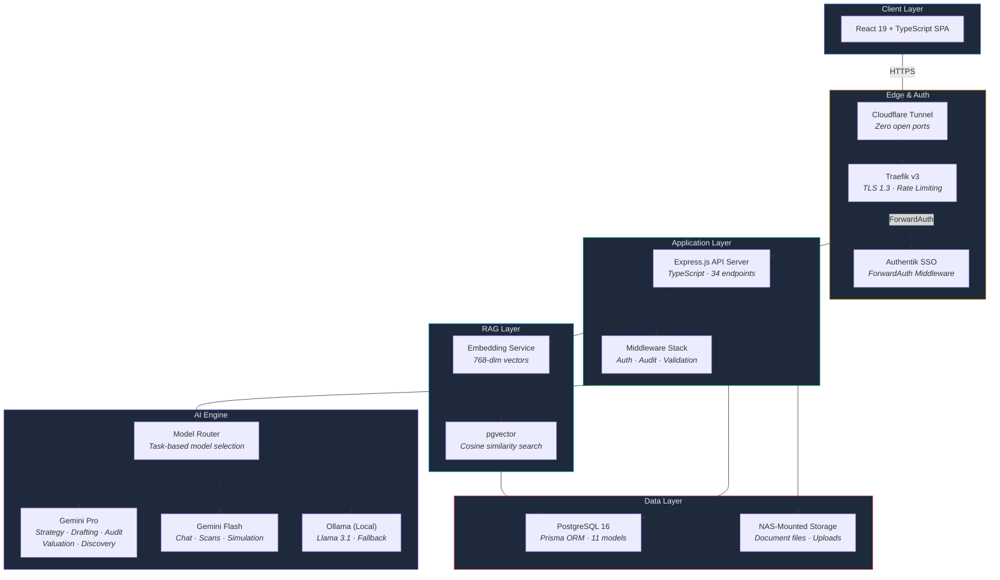
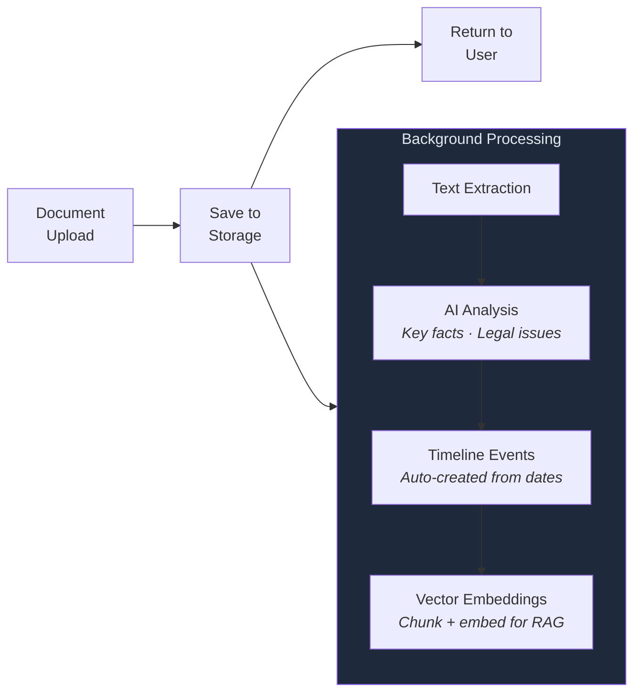
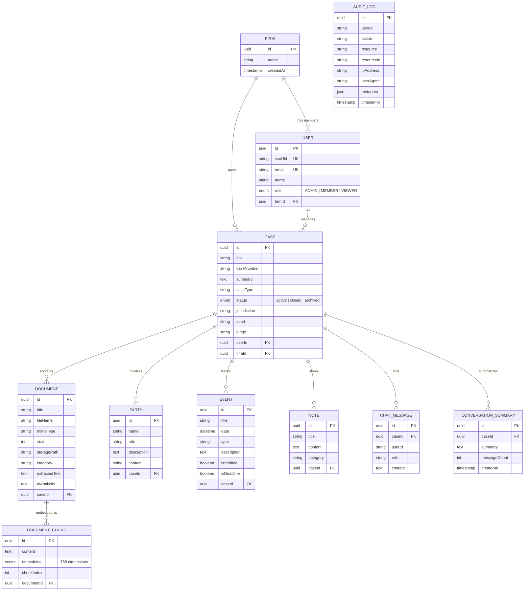
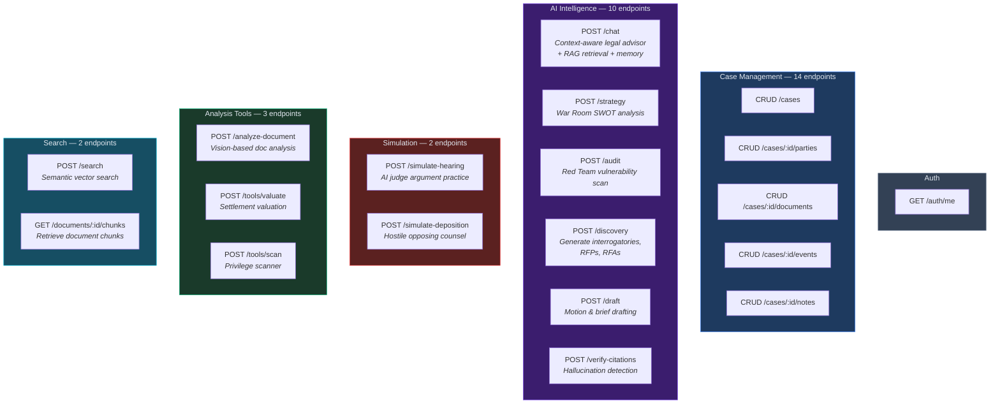
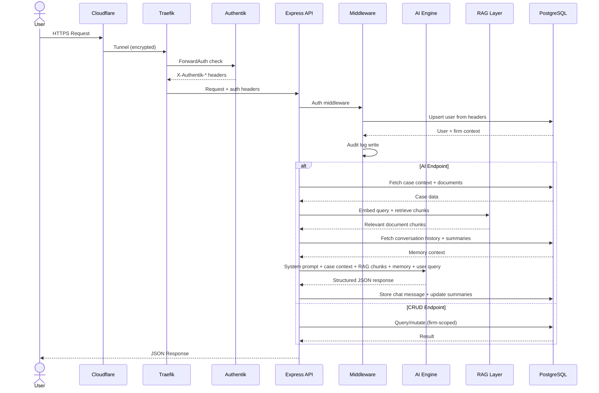
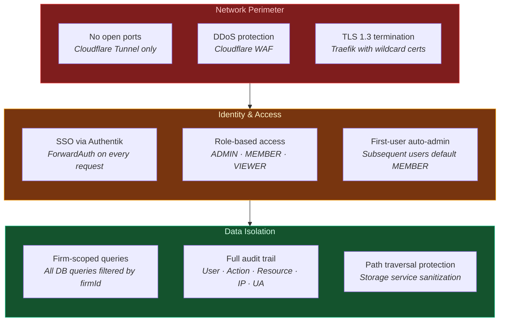
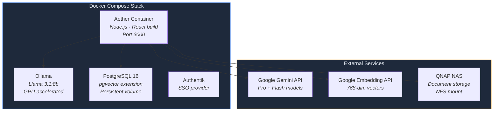

# Aether — System Architecture

> AI-native litigation intelligence platform. Case briefing, adversarial analysis, discovery automation, and trial preparation — built for speed.

---

## System Overview

Aether is a full-stack litigation intelligence platform designed to turn raw case data (pleadings, depositions, discovery productions, expert reports) into structured, actionable intelligence. The system runs as a containerized service within a zero-trust homelab infrastructure.

---

## AI Engine Architecture

The AI layer uses **task-based model routing** — each request type maps to the optimal model for that task. Complex reasoning (strategy, audits, drafting) routes to the most capable model. Lighter tasks (chat, scans, simulations) route to a faster model. Local Ollama provides an always-available fallback.

### Cognitive Core

All AI agents share a unified **Cognitive Protocol** — a structured reasoning framework that enforces analytical rigor:

| Protocol | Function |
|----------|----------|
| Elemental Analysis | Break claims into elements, check satisfaction |
| Adversarial Reasoning | Predict opponent's next 3 moves |
| Strategy Sequencing | Sequence actions for momentum |
| Risk Intelligence | Measure procedural, evidentiary, narrative risk |
| Narrative Construction | Find the emotional anchor |
| Contradiction Detector | Spot inconsistencies in testimony/evidence |
| Precedent Mapping | Identify controlling precedent |
| Procedural Exploitation | Find missed deadlines, waived objections |
| Leverage Calibration | Calculate BATNA, settlement corridor |
| Evidence Chain | Map chain of custody, find weak links |
| Credibility Assessment | Evaluate witness reliability |
| Exit Strategy | Calculate settlement ranges |

Each AI module (War Room, Red Team, Discovery, etc.) inherits these protocols and applies them through specialized system instructions with jurisdiction-aware constraints.

---

## RAG Pipeline

Documents are processed into vector embeddings for semantic retrieval, ensuring AI responses are grounded in actual case evidence.

---

## Conversation Memory

The AI Legal Advisor maintains persistent memory across sessions using a hybrid approach:

---

## Document Processing Pipeline

Every document upload triggers an asynchronous, fire-and-forget processing pipeline:

---

## Data Model

Multi-tenant architecture with firm-level data isolation, vector search, conversation memory, and full audit trail.

---

## API Surface

34 RESTful endpoints organized by domain. Every mutating endpoint writes to the audit log.

---

## Request Lifecycle

Every request passes through the same pipeline: edge security → authentication → authorization → audit → processing.

---

## Security Model

---

## Jurisdiction Engine

Multi-jurisdiction support with configurable legal constraints per case. Each AI agent is bound to the applicable jurisdiction's statutes, procedural rules, and court conventions.

---

## Deployment

Single Docker container deployed within the Eola Gateway homelab stack. The container runs alongside Ollama (local LLM), PostgreSQL, Authentik, and supporting infrastructure services.

---

## Tech Stack

| Layer | Technology | Purpose |
|-------|-----------|---------|
| Frontend | React 19, TypeScript, Vite, Tailwind CSS | Single-page application |
| Backend | Express.js, TypeScript | REST API server |
| Database | PostgreSQL 16, Prisma ORM, pgvector | Relational data + vector search |
| AI (Primary) | Google Gemini Pro/Flash | Complex reasoning + chat |
| AI (Fallback) | Ollama + Llama 3.1:8b | Local inference, offline capability |
| Embeddings | Google Embedding API | 768-dim document vectors |
| Auth | Authentik SSO via Traefik ForwardAuth | Zero-trust identity |
| Reverse Proxy | Traefik v3 | TLS, routing, auth middleware |
| Edge | Cloudflare Tunnel | Secure ingress, no open ports |
| Storage | NAS-mounted filesystem | Document persistence |
| Containerization | Docker + Docker Compose | Deployment + isolation |

---

## License

Copyright 2026 Jake Sadoway. All rights reserved. This repository is shared for portfolio and demonstration purposes only. No license is granted for commercial use, reproduction, or derivative works without written permission.
