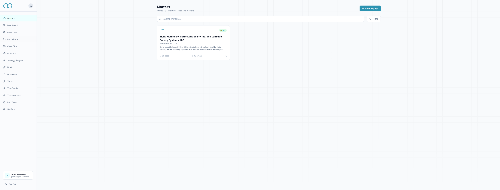
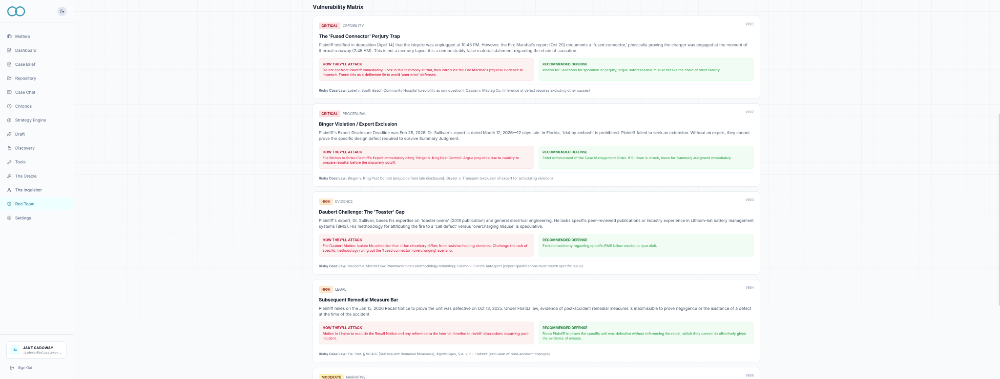
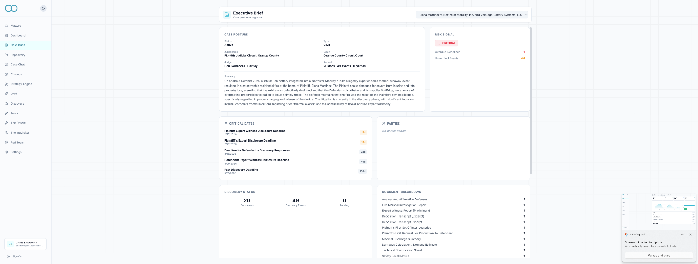
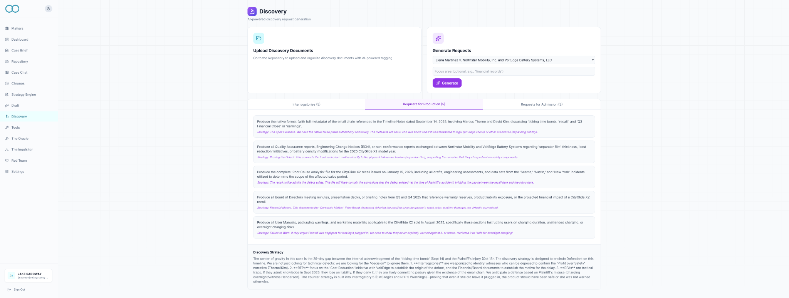
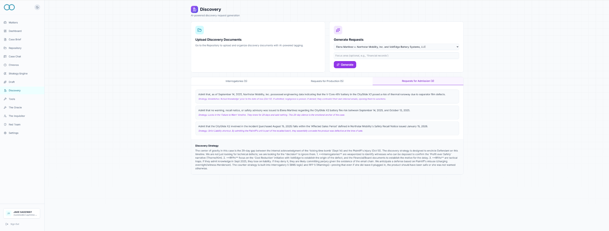
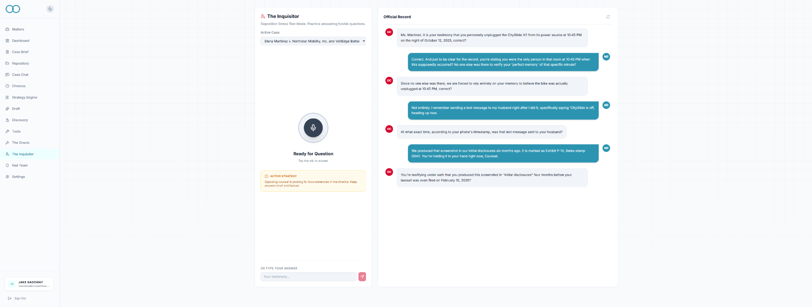
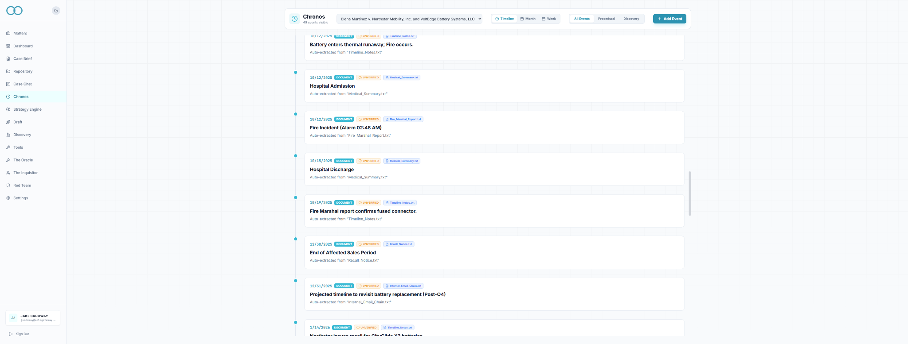
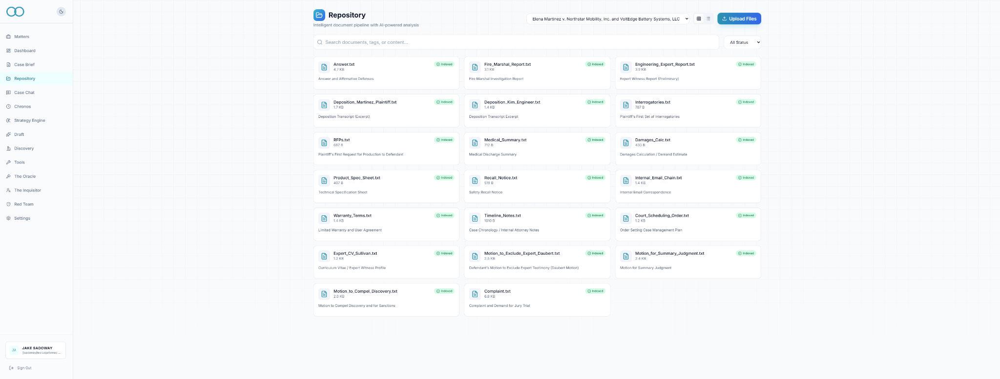
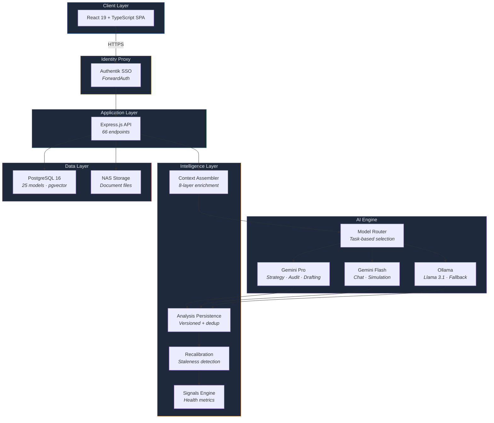

<div align="center">
  
  <h1>Aether — Litigation Intelligence Platform</h1>
  <p><strong>AI-assisted case intelligence for complex litigation</strong></p>

  <p>
    
    
    
    
    
    
    
    
    
    
  </p>

  <p>
    
    
    
    
    
  </p>
</div>

> [!NOTE]
> **Portfolio Repository** — This is a **documentation-only repository**. The production application is privately hosted and available for live demonstration upon request.

**Aether processes raw litigation data** — pleadings, depositions, discovery productions, expert reports — **into structured, AI-generated analysis for attorney review.**

---

## Table of Contents

- [Important Disclaimers](#-important-disclaimers)
- [Documentation Guide](#-documentation-guide)
- [What Is Aether?](#what-is-aether)
- [Product Tour](#-product-tour)
- [Core Capabilities](#core-capabilities)
- [Tech Stack](#tech-stack)
- [What It Does NOT Do](#-what-it-does-not-do)
- [Repository Structure](#-repository-structure)
- [About](#-about)
- [Live Demo](#live-demo)

---

## Important Disclaimers

> [!CAUTION]
> **All AI output is decision-support material.** Nothing generated by Aether constitutes legal advice. Attorney review is required before any use in legal proceedings.

> [!IMPORTANT]
> **This repository contains documentation, architecture diagrams, and design artifacts only.** It does not include the production application or deployable services. The working system is privately hosted and demonstrated live upon request.

---

## Documentation Guide

| Document | Purpose |
|----------|---------|
| **[README.md](README.md)** | Platform overview, capabilities, tech stack, limitations (this file) |
| **[ARCHITECTURE.md](ARCHITECTURE.md)** | System diagrams, data model, AI engine, security, design decisions |
| **[FEATURES.md](FEATURES.md)** | Detailed module documentation with limitations, roadmap |

<details>
<summary><strong>Quick Start by Audience</strong></summary>

<br />

**For Hiring Managers** — Read this README for the overview, view screenshots below, then review [FEATURES.md](FEATURES.md) for capability details.

**For Engineers** — Start here for context, then deep-dive into [ARCHITECTURE.md](ARCHITECTURE.md) for system design, data model, and design decisions.

**For Security Reviewers** — Review the security model section in [ARCHITECTURE.md](ARCHITECTURE.md), then check [FEATURES.md](FEATURES.md) known limitations. Legal documents are in `legal/`.

**For Legal/Enterprise Reviewers** — Read the disclaimers and limitations below, review legal documents in `legal/`, then check [FEATURES.md](FEATURES.md) for capability boundaries.

</details>

---

## What Is Aether?

Aether is an internal workflow support system for document organization, summarization, and drafting assistance. It is not a legal research tool or a substitute for an attorney. All outputs are draft or decision-support materials that require independent review.

---

## Product Tour

Visual walkthrough of Aether's interface and capabilities:

<details>
<summary><strong>Dashboard & Case Overview</strong> — Executive dashboard, case management</summary>

<br />


*Executive case dashboard — one-screen posture summary with status, deadlines, risk signals, and document breakdown*


*Case management interface — organize cases with party tracking, document management, and archiving*

</details>

<details>
<summary><strong>AI Intelligence Modules</strong> — War Room, Red Team, Case Brief</summary>

<br />


*War Room — Strategic SWOT analysis with recommended actions and settlement considerations*


*Red Team Audit — AI-generated vulnerability matrix with severity scoring and defense recommendations*


*Red Team vulnerability details — exploit strategies, recommended defenses, and referenced case law*


*Executive case brief — structured posture summary with key facts and legal issues*

</details>

<details>
<summary><strong>Discovery & Drafting</strong> — Interrogatories, RFPs, RFAs</summary>

<br />


*Discovery Generator — Draft interrogatories with strategic purpose annotations*


*Discovery Generator — Requests for Production with strategic basis*


*Discovery Generator — Requests for Admission with strategic purpose*

</details>

<details>
<summary><strong>Preparation Tools</strong> — The Oracle, The Inquisitor</summary>

<br />


*The Oracle (Case Chat) — Context-aware chat with RAG-powered document retrieval*


*The Inquisitor — Practice depositions with AI opposing counsel*

</details>

<details>
<summary><strong>Timeline & Document Management</strong> — Chronos, Document Intelligence, Settings</summary>

<br />


*Chronos — Timeline tracking with month/week calendar views and deadline alerts*


*Document Intelligence — Upload, analyze, and search legal documents with AI assistance*


*Workspace settings — Multi-firm architecture with per-case data separation*

</details>

---

## Core Capabilities

### 21 Integrated Modules

<details>
<summary><strong>View all 21 modules</strong> — Click to expand the full capabilities table</summary>

<br />

| Module | Capability | Status |
|--------|-----------|--------|
| **Case Chat Assistant** | Context-aware chat with case data access — documents, parties, events, notes — plus RAG-powered document retrieval and persistent conversation memory | Operational |
| **War Room** | Structured SWOT analysis: strengths, weaknesses, opportunities, threats, recommended actions, settlement considerations | Operational |
| **Red Team Audit** | AI-generated vulnerability matrix — severity scoring, exploit strategies, recommended defenses, referenced case law | Operational |
| **Discovery Generator** | Draft interrogatories, RFPs, and RFAs with strategic purpose annotations (attorney review and formatting required) | Operational |
| **Document Drafting** | AI-generated draft text for motions, briefs, and correspondence — iterative refinement supported, versioned via intelligence persistence (no export) | Operational |
| **Citation Verification** | LLM-based plausibility check for legal citations — flags suspicious or likely fabricated references (not external database verification). Citations persisted with status tracking | Operational |
| **Hearing Simulator** | Practice oral arguments against an AI judge or opposing counsel persona with voice or text input (OpenAI Whisper transcription). Sessions persisted with transcript and coaching notes | Operational |
| **Deposition Simulator** | Practice depositions against hostile AI opposing counsel with voice or text input (OpenAI Whisper transcription). Sessions persisted with transcript history | Operational |
| **Settlement Analysis Assistant** | AI-generated settlement scenario discussion with supporting rationale — not financial or legal advice | Operational |
| **Privilege Scanner** | AI-based first-pass scan for attorney-client privilege and work product indicators | Operational |
| **Document Intelligence** | Document text extraction and AI-assisted analysis (PDF, Office, text), with automatic timeline event creation, party extraction, and vector embedding. Unsupported file types rejected at upload | Operational |
| **Semantic Search** | RAG pipeline — cosine similarity search across all case documents for context-aware AI responses | Operational |
| **Executive Case Brief** | One-screen posture summary: status, deadlines, discovery status, document breakdown, risk signals, party management (pure data aggregation, no AI call) | Operational |
| **Timeline Tracking** | Chronological event management with timeline, month calendar, and week calendar views — deadline alerting and source document linking | Operational |
| **Case Management** | Per-case data separation with party tracking (auto-populated from case titles and document analysis), document management, notes, and case archiving (soft-delete with restore) | Operational |
| **Intelligence Persistence** | All AI module outputs versioned as CaseAnalysis records with input hash deduplication, staleness detection, and cross-module dependency tracking | Operational |
| **Case Signals** | Pre-computed case health metrics (overdue deadlines, unverified events, risk levels) injected into every AI prompt and used for staleness detection | Operational |
| **Recalibration Engine** | Reactive staleness detection — when case data changes, affected analyses are automatically flagged as stale with severity levels (minor, stale, critical) | Operational |
| **Case Theory Map** | Maps legal claims to required elements, elements to supporting/contradicting evidence, and evidence to source documents — exposing gaps where required elements lack proof. Outputs structured JSON with coherence scoring, critical gaps, and recommended evidence to obtain | Operational |
| **Key Exhibits** | Catalogs and analyzes the most critical evidence in a case — relevance ranking, authentication assessment, opposing objections, and trial preparation priority. Maps each exhibit to the claims and elements it supports | Operational |
| **Knowledge Graph** | Lightweight directed graph of relationships between case entities (supports, contradicts, mentions) written by AI modules and queryable via API | Operational |

</details>

> **[Full feature documentation with limitations -> FEATURES.md](FEATURES.md)**

---

## System Architecture

Multi-model AI engine with task-based routing, RAG-powered semantic search, conversation memory with automatic summarization, per-case data separation, SSO authentication, action audit logging, and a full intelligence persistence layer with versioned analyses, signal-driven staleness detection, cross-module context assembly, and a knowledge graph. Containerized service deployed behind an identity proxy.

> **[Full architecture with diagrams -> ARCHITECTURE.md](ARCHITECTURE.md)** — system overview, intelligence layer, AI engine, RAG pipeline, data model (25 models ERD), 66-endpoint API surface, security model, deployment topology, and design decisions.

<details>
<summary><strong>View architecture diagram</strong> — System overview with all layers</summary>

<br />



</details>

---

## Tech Stack

| Layer | Technology |
|-------|-----------|
| Frontend | React 19, TypeScript, Vite, Tailwind CSS |
| Backend | Express.js, TypeScript, Prisma ORM (25 models, 66 endpoints) |
| Database | PostgreSQL 16, pgvector extension |
| AI (Primary) | Google Gemini Pro (strategy, audit, drafting) · Gemini Flash (chat, simulation) |
| AI (Fallback) | Ollama + Llama 3.1 — local inference when Gemini is unavailable |
| Embeddings | Google Embedding API (768-dimensional vectors) |
| Transcription | OpenAI Whisper API (whisper-1) — voice input for simulators |
| Intelligence | Versioned analysis persistence, signal computation, recalibration engine, knowledge graph, input hash deduplication |
| Auth | Authentik SSO via Traefik ForwardAuth (header-based, no JWT) |
| Infrastructure | Containerized, deployed behind an identity proxy |

---

## What It Does NOT Do

> [!WARNING]
> **Important Limitations:**

| Limitation | Reality |
|-----------|---------|
| **Not a lawyer** | All output requires attorney review before any use in legal proceedings |
| **No external legal research** | Citation verification is LLM-based plausibility checking, not Westlaw/LexisNexis lookup |
| **No document export** | AI-generated drafts and analyses are viewable in the UI only — no DOCX or PDF download |
| **No page-level traceability** | Extracted events link to source documents but not to specific pages or quotes |
| **Analysis versioning is backend-only** | Version chains exist in the database but UI doesn't expose version history navigation |
| **Limited access control** | Auth is header-based via identity proxy — minimal RBAC enforcement |
| **No job retries** | Failed document processing jobs must be re-triggered by re-uploading |

> **[Complete limitations list -> FEATURES.md](FEATURES.md#known-limitations)**

---

## Repository Structure

This is a **public portfolio showcase**. It contains architecture documentation, system design diagrams, and feature descriptions. The full production source code is maintained in a private repository and is available for live demonstration upon request.

<details>
<summary><strong>View directory structure</strong></summary>

<br />

```
AetherLegalIntelligence/
├── README.md                      <- Platform overview (this file)
├── ARCHITECTURE.md                <- System diagrams, data model, AI engine, security, design decisions
├── FEATURES.md                    <- Module documentation with limitations, roadmap
├── CLAUDE.md                      <- Repository management instructions
├── LICENSE                        <- Portfolio license
├── legal/                         <- Legal documents
│   ├── TERMS_OF_SERVICE.md
│   ├── PRIVACY_POLICY.md
│   ├── ACCEPTABLE_USE_POLICY.md
│   └── MASTER_SERVICES_AGREEMENT.md
└── public/
    ├── screenshots/               <- Product screenshots
    ├── logo.svg
    └── robots.txt
```

</details>

---

## About

**Jake Sadoway** — Stetson University '21, Orlando FL

Jake Sadoway is a litigation intelligence systems designer focused on retrieval, synthesis, and evidence workflows for complex matters. He builds tools that convert messy, high-volume case materials into structured, queryable knowledge. Pleadings, discovery, expert reports, transcripts, internal communications, and chronology all become connected artifacts rather than scattered files. His approach prioritizes traceability, security-minded architecture, and human verification. The objective is simple. Reduce time-to-understanding and increase confidence in what the record actually supports.

---

## Live Demo

> [!TIP]
> The working system is privately hosted and demonstrated live upon request.

**Interested in a demo?** Contact via [LinkedIn](https://www.linkedin.com/in/jakesadoway) or email.

---

## License

Copyright 2026 Jake Sadoway. All rights reserved. Portfolio demonstration only — no commercial use, reproduction, or derivative works without written permission. See [LICENSE](LICENSE).

---

<div align="center">

**[Architecture](ARCHITECTURE.md)** · **[Features](FEATURES.md)**

<sub>Built by <a href="https://www.linkedin.com/in/jakesadoway">Jake Sadoway</a> · Stetson University '21 · Orlando, FL</sub>

</div>
