<div align="center">
  
  <h1>Aether — Litigation Intelligence Platform</h1>
  <p><strong>AI-assisted case intelligence for complex litigation</strong></p>

  <p>
    
    
    
    
    
    
    
    
    
    
  </p>

  <p>
    
    
    
    
    
  </p>
</div>

> [!NOTE]
> **Portfolio Repository** — This is a **documentation-only repository**. The production application is privately hosted and available for live demonstration upon request.

**Aether processes raw litigation data** — pleadings, depositions, discovery productions, expert reports — **into structured, AI-generated analysis for attorney review.**

---

## Table of Contents

- [Important Disclaimers](#-important-disclaimers)
- [Documentation Navigation](#-documentation-navigation)
- [What Is Aether?](#what-is-aether)
- [Product Tour](#-product-tour)
- [Core Capabilities](#core-capabilities)
- [System Architecture](#system-architecture)
- [Tech Stack](#tech-stack)
- [What It Does NOT Do](#-what-it-does-not-do)
- [Repository Structure](#-repository-structure)
- [About](#-about)
- [Live Demo](#live-demo)

---

## ⚠️ Important Disclaimers

> [!CAUTION]
> **All AI output is decision-support material.** Nothing generated by Aether constitutes legal advice. Attorney review is required before any use in legal proceedings.

> [!IMPORTANT]
> **This repository contains documentation, architecture diagrams, and design artifacts only.** It does not include the production application or deployable services. The working system is privately hosted and demonstrated live upon request.

---

## 📚 Documentation Navigation

> [!TIP]
> **New to Aether?** Start here: **[START_HERE.md](START_HERE.md)** — Complete navigation guide with quick-start paths for different audiences.

| Document | Purpose | Audience |
|----------|---------|----------|
| **[START_HERE.md](START_HERE.md)** | Navigation guide with quick-start paths | Everyone |
| **[ARCHITECTURE.md](ARCHITECTURE.md)** | System diagrams, data model, AI engine | Engineers, architects |
| **[FEATURES.md](FEATURES.md)** | Detailed module documentation with limitations | Product managers, engineers |
| **[IMPLEMENTATION.md](IMPLEMENTATION.md)** | Technical implementation and design details | Engineers |
| **[SECURITY.md](SECURITY.md)** | Security model and authentication | Security reviewers, IT |
| **[TECHNICAL_DECISIONS.md](TECHNICAL_DECISIONS.md)** | Design decisions and trade-offs | Engineers, architects |

---

## What Is Aether?

Aether is an internal workflow support system for document organization, summarization, and drafting assistance. It is not a legal research tool or a substitute for an attorney. All outputs are draft or decision-support materials that require independent review.

---

## 📸 Product Tour

Visual walkthrough of Aether's interface and capabilities:

<details>
<summary><strong>🖥️ Dashboard & Case Overview</strong> — Executive dashboard, case management</summary>

<br />


*Executive case dashboard — one-screen posture summary with status, deadlines, risk signals, and document breakdown*


*Case management interface — organize cases with party tracking, document management, and archiving*

</details>

<details>
<summary><strong>🧠 AI Intelligence Modules</strong> — War Room, Red Team, Case Brief</summary>

<br />


*War Room — Strategic SWOT analysis with recommended actions and settlement considerations*


*Red Team Audit — AI-generated vulnerability matrix with severity scoring and defense recommendations*


*Red Team vulnerability details — exploit strategies, recommended defenses, and referenced case law*


*Executive case brief — structured posture summary with key facts and legal issues*

</details>

<details>
<summary><strong>📋 Discovery & Drafting</strong> — Interrogatories, RFPs, RFAs</summary>

<br />


*Discovery Generator — Draft interrogatories with strategic purpose annotations*


*Discovery Generator — Requests for Production with strategic basis*


*Discovery Generator — Requests for Admission with strategic purpose*

</details>

<details>
<summary><strong>🎯 Preparation Tools</strong> — The Oracle, The Inquisitor</summary>

<br />


*The Oracle (Case Chat) — Context-aware chat with RAG-powered document retrieval*


*The Inquisitor — Practice depositions with AI opposing counsel*

</details>

<details>
<summary><strong>📅 Timeline & Document Management</strong> — Chronos, Document Intelligence, Settings</summary>

<br />


*Chronos — Timeline tracking with month/week calendar views and deadline alerts*


*Document Intelligence — Upload, analyze, and search legal documents with AI assistance*


*Workspace settings — Multi-firm architecture with per-case data separation*

</details>

---

## Core Capabilities

### 17 Integrated Modules

<details>
<summary><strong>View all 17 modules</strong> — Click to expand the full capabilities table</summary>

<br />

| Module | Capability | Status |
|--------|-----------|--------|
| **Case Chat Assistant** | Context-aware chat with case data access — documents, parties, events, notes — plus RAG-powered document retrieval and persistent conversation memory | ✅ Operational |
| **War Room** | Structured SWOT analysis: strengths, weaknesses, opportunities, threats, recommended actions, settlement considerations | ✅ Operational |
| **Red Team Audit** | AI-generated vulnerability matrix — severity scoring, exploit strategies, recommended defenses, referenced case law | ✅ Operational |
| **Discovery Generator** | Draft interrogatories, RFPs, and RFAs with strategic purpose annotations (attorney review and formatting required) | ✅ Operational |
| **Document Drafting** | AI-generated draft text for motions, briefs, and correspondence — iterative refinement supported, versioned via intelligence persistence (no export) | ✅ Operational |
| **Citation Verification** | LLM-based plausibility check for legal citations — flags suspicious or likely fabricated references (not external database verification). Citations persisted with status tracking | ✅ Operational |
| **Hearing Simulator** | Practice oral arguments against an AI judge or opposing counsel persona with voice or text input (OpenAI Whisper transcription). Sessions persisted with transcript and coaching notes | ✅ Operational |
| **Deposition Simulator** | Practice depositions against hostile AI opposing counsel with voice or text input (OpenAI Whisper transcription). Sessions persisted with transcript history | ✅ Operational |
| **Settlement Analysis Assistant** | AI-generated settlement scenario discussion with supporting rationale — not financial or legal advice | ✅ Operational |
| **Privilege Scanner** | AI-based first-pass scan for attorney-client privilege and work product indicators | ✅ Operational |
| **Document Intelligence** | Document text extraction and AI-assisted analysis (PDF, Office, text), with timeline event creation and vector embedding. Unsupported file types rejected at upload | ✅ Operational |
| **Semantic Search** | RAG pipeline — cosine similarity search across all case documents for context-aware AI responses | ✅ Operational |
| **Executive Case Brief** | One-screen posture summary: status, deadlines, discovery status, document breakdown, risk signals (pure data aggregation, no AI call) | ✅ Operational |
| **Timeline Tracking** | Chronological event management with timeline, month calendar, and week calendar views — deadline alerting and source document linking | ✅ Operational |
| **Case Management** | Per-case data separation with party tracking, document management, notes, and case archiving (soft-delete with restore) | ✅ Operational |
| **Intelligence Persistence** | All AI module outputs versioned as CaseAnalysis records with input hash deduplication, staleness detection, and cross-module dependency tracking | ✅ Operational |
| **Case Signals** | Pre-computed case health metrics (overdue deadlines, unverified events, risk levels) injected into every AI prompt and used for staleness detection | ✅ Operational |
| **Recalibration Engine** | Reactive staleness detection — when case data changes, affected analyses are automatically flagged as stale with severity levels (minor, stale, critical) | ✅ Operational |
| **Knowledge Graph** | Lightweight directed graph of relationships between case entities (supports, contradicts, mentions) written by AI modules and queryable via API | ✅ Operational |

</details>

> **[Full feature documentation with limitations → FEATURES.md](FEATURES.md)**

---

## System Architecture

Multi-model AI engine with task-based routing, RAG-powered semantic search, conversation memory with automatic summarization, per-case data separation, SSO authentication, action audit logging, and a full intelligence persistence layer with versioned analyses, signal-driven staleness detection, cross-module context assembly, and a knowledge graph. Containerized service deployed behind an identity proxy.

> **[System architecture with diagrams → ARCHITECTURE.md](ARCHITECTURE.md)** — includes data model, AI engine, RAG pipeline, request lifecycle, security model, and deployment topology.

### Architecture Highlights

```mermaid
flowchart TB
    subgraph CLIENT["Client Layer"]
        UI["React 19 + TypeScript SPA"]
    end

    subgraph EDGE["Identity Proxy"]
        AK["Authentik SSO<br/><i>ForwardAuth</i>"]
    end

    subgraph API["Application Layer"]
        EX["Express.js API<br/><i>63 endpoints</i>"]
    end

    subgraph AI["AI Engine"]
        RT["Model Router<br/><i>Task-based selection</i>"]
        G3P["Gemini Pro<br/><i>Strategy · Audit · Drafting</i>"]
        G3F["Gemini Flash<br/><i>Chat · Simulation</i>"]
        OL["Ollama<br/><i>Llama 3.1 · Fallback</i>"]
    end

    subgraph INTEL["Intelligence Layer"]
        CTX["Context Assembler<br/><i>8-layer enrichment</i>"]
        SIG["Signals Engine<br/><i>Health metrics</i>"]
        PERSIST["Analysis Persistence<br/><i>Versioned + dedup</i>"]
        RECAL["Recalibration<br/><i>Staleness detection</i>"]
    end

    subgraph DATA["Data Layer"]
        PG["PostgreSQL 16<br/><i>25 models · pgvector</i>"]
        FS["NAS Storage<br/><i>Document files</i>"]
    end

    UI -->|HTTPS| AK
    AK --> EX
    EX --> CTX
    CTX --> RT
    RT --> G3P & G3F & OL
    G3P & G3F & OL --> PERSIST
    PERSIST --> RECAL
    RECAL --> SIG
    EX --> PG & FS

    style CLIENT fill:#1e293b,stroke:#3b82f6,color:#e2e8f0
    style EDGE fill:#1e293b,stroke:#f59e0b,color:#e2e8f0
    style API fill:#1e293b,stroke:#10b981,color:#e2e8f0
    style AI fill:#1e293b,stroke:#8b5cf6,color:#e2e8f0
    style INTEL fill:#1e293b,stroke:#f97316,color:#e2e8f0
    style DATA fill:#1e293b,stroke:#ef4444,color:#e2e8f0
```

<details>
<summary><strong>View architecture diagram</strong> — System overview with all layers</summary>

<br />



</details>

---

## Tech Stack

| Layer | Technology |
|-------|-----------|
| Frontend | React 19, TypeScript, Vite, Tailwind CSS |
| Backend | Express.js, TypeScript, Prisma ORM (25 models, 63 endpoints) |
| Database | PostgreSQL 16, pgvector extension |
| AI (Primary) | Google Gemini Pro (strategy, audit, drafting) · Gemini Flash (chat, simulation) |
| AI (Fallback) | Ollama + Llama 3.1 — local inference when Gemini is unavailable |
| Embeddings | Google Embedding API (768-dimensional vectors) |
| Transcription | OpenAI Whisper API (whisper-1) — voice input for simulators |
| Intelligence | Versioned analysis persistence, signal computation, recalibration engine, knowledge graph, input hash deduplication |
| Auth | Authentik SSO via Traefik ForwardAuth (header-based, no JWT) |
| Infrastructure | Containerized, deployed behind an identity proxy |

---

## ⚠️ What It Does NOT Do

> [!WARNING]
> **Important Limitations:**

<details>
<summary><strong>View all limitations</strong> — Click to expand</summary>

<br />

| Limitation | Reality | Implication |
|-----------|---------|-------------|
| **Not a lawyer** | All output requires attorney review | No AI-generated content should be filed or relied upon without independent verification |
| **No external legal research** | Citation verification is LLM-based plausibility checking, not Westlaw/LexisNexis lookup | "Verified" means the LLM is confident, not that the citation is confirmed |
| **No document export** | AI-generated drafts, discovery requests, and analyses are viewable in the UI only | No DOCX or PDF download — content must be manually copied and reformatted |
| **No page-level traceability** | Extracted events link to source documents but not to specific pages or quotes within them | Users must manually locate referenced content within documents |
| **Analysis versioning is backend-only** | AI analyses are versioned in the database with full version chains, but the UI does not yet expose version history navigation or diff views | Cannot see how analysis evolved over time through the UI |
| **Limited access control** | Auth is header-based via identity proxy — no application-layer JWT or HMAC verification. RBAC roles are stored but enforcement is minimal | Only case deletion checks for Admin role; other permissions not enforced |
| **No job retries** | Failed document processing jobs must be re-triggered by re-uploading | Transient failures require manual intervention |

</details>

> **[Complete limitations list → FEATURES.md](FEATURES.md#known-limitations)**

---

## 📂 Repository Structure

This is a **public portfolio showcase**. It contains architecture documentation, system design diagrams, and feature descriptions. The full production source code is maintained in a private repository and is available for live demonstration upon request.

<details>
<summary><strong>View directory structure</strong></summary>

<br />

```
AetherLegalIntelligence/
├── README.md                      ← Platform overview (this file)
├── START_HERE.md                  ← Navigation guide with quick-start paths
├── ARCHITECTURE.md                ← System diagrams, data model, AI engine
├── FEATURES.md                    ← Module documentation with limitations
├── IMPLEMENTATION.md              ← Technical implementation details
├── SECURITY.md                    ← Security model and authentication
├── TECHNICAL_DECISIONS.md         ← Design decisions and trade-offs
├── CLAUDE.md                      ← Repository management instructions
├── LICENSE                        ← Portfolio license
├── legal/                         ← Legal documents
│   ├── TERMS_OF_SERVICE.md
│   ├── PRIVACY_POLICY.md
│   ├── ACCEPTABLE_USE_POLICY.md
│   └── MASTER_SERVICES_AGREEMENT.md
└── public/
    ├── screenshots/               ← Product screenshots
    ├── logo.svg
    └── robots.txt
```

</details>

---

## 👤 About

**Jake Sadoway** — Stetson University '21, Orlando FL  

Jake Sadoway is a litigation intelligence systems designer focused on retrieval, synthesis, and evidence workflows for complex matters. He builds tools that convert messy, high-volume case materials into structured, queryable knowledge. Pleadings, discovery, expert reports, transcripts, internal communications, and chronology all become connected artifacts rather than scattered files. His approach prioritizes traceability, security-minded architecture, and human verification. The objective is simple. Reduce time-to-understanding and increase confidence in what the record actually supports.

---

## 🚀Live Demo

> [!TIP]
> The working system is privately hosted and demonstrated live upon request.

**Interested in a demo?** Contact via [LinkedIn](https://www.linkedin.com/in/jakesadoway) or email.

---

## 📄 License

Copyright 2026 Jake Sadoway. All rights reserved. Portfolio demonstration only — no commercial use, reproduction, or derivative works without written permission. See [LICENSE](LICENSE).

---

<div align="center">

**[START_HERE](START_HERE.md)** · **[Architecture](ARCHITECTURE.md)** · **[Features](FEATURES.md)** · **[Implementation](IMPLEMENTATION.md)** · **[Security](SECURITY.md)** · **[Technical Decisions](TECHNICAL_DECISIONS.md)**

<sub>Built by <a href="https://www.linkedin.com/in/jakesadoway">Jake Sadoway</a> · Stetson University '21 · Orlando, FL</sub>

</div>
