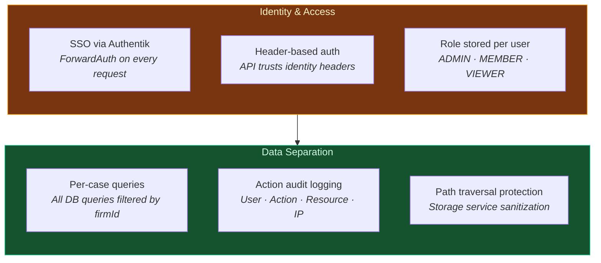
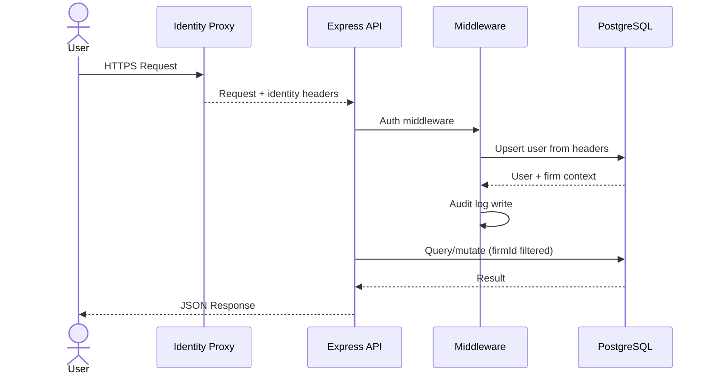
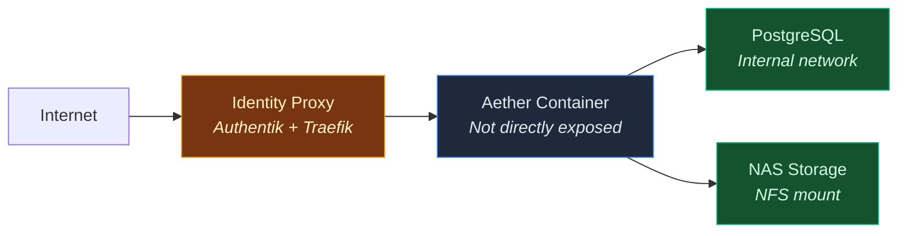

# Security Model — Aether Authentication & Data Protection

> [!NOTE]
> This document describes the security architecture of the Aether platform. All information is derived from [ARCHITECTURE.md](ARCHITECTURE.md) and [FEATURES.md](FEATURES.md).

---

## Table of Contents

- [Overview](#overview)
- [Identity & Authentication](#identity--authentication)
- [Data Separation](#data-separation)
- [Audit Logging](#audit-logging)
- [API Security](#api-security)
- [Current Limitations](#current-limitations)
- [Security Perimeter](#security-perimeter)

---

## Overview

Aether is a **containerized service deployed behind an identity proxy**. The API is not directly exposed and trusts identity headers from the upstream proxy. There is no application-layer cryptographic verification (no JWT, no HMAC, no mTLS).

### Security Model Summary



---

## Identity & Authentication

### SSO via Authentik

All requests pass through Authentik SSO using Traefik ForwardAuth middleware:

1. **Client Request** → Identity Proxy (Authentik)
2. **ForwardAuth Check** → Validates session
3. **Identity Headers Injected** → `X-Forwarded-User`, `X-Forwarded-Email`, etc.
4. **Request Forwarded** → Aether API

### Header-Based Authentication

The API trusts identity headers from the upstream proxy:

- **No JWT signature verification** at the application layer
- **No HMAC** validation
- **No mTLS** client certificates
- API assumes headers are authentic (relies on network perimeter security)

### User Provisioning

On every authenticated request:

1. Auth middleware extracts identity headers
2. User record is **upserted** in database (created if new, updated if exists)
3. User is associated with their firm
4. Request context includes user ID and firm ID

### Role Model

Three roles stored per user:

| Role | Intended Permissions |
|------|---------------------|
| **ADMIN** | Full access — currently only enforced for case deletion |
| **MEMBER** | Standard access — no restrictions currently enforced |
| **VIEWER** | Read-only access — not currently enforced |

**Current limitation:**

> [!WARNING]
> RBAC enforcement is minimal. Only case deletion checks for Admin role. Viewer restrictions are not enforced. Full RBAC enforcement is on the roadmap.

---

## Data Separation

### Multi-Tenant Architecture

- **Firm-level isolation** — All data scoped to a firm
- **Per-case queries** — All database queries filtered by the authenticated user's `firmId`
- **No cross-firm access** — Users can only access cases belonging to their firm

### Query Filtering

Every database query includes firm context:

```typescript
// Example: All case queries filtered by firmId
await prisma.case.findMany({
  where: {
    firmId: user.firmId,
    // ... other filters
  }
})
```

### Storage Security

- **Path traversal protection** — Storage service sanitizes file paths
- **NAS-mounted storage** — Document files stored on persistent NFS mount
- **Per-case file organization** — Documents organized by case ID

---

## Audit Logging

### Action Audit Log

System-wide audit trail recording:

- **User ID** — Who performed the action
- **Action** — What operation was performed
- **Resource** — What type of entity was affected
- **Resource ID** — Specific entity identifier
- **IP Address** — Request origin
- **User Agent** — Client information
- **Metadata** — Additional context (JSON)
- **Timestamp** — When the action occurred

### Case Event Log

Per-case mutation log tracking:

- **Event Type** — Type of data change
- **Payload** — Event-specific data
- **User ID** — Who triggered the change
- **Timestamp** — When the change occurred

Used by the recalibration engine to detect when analyses need updating.

### Current Limitations

- **No before/after state** — Audit log records actions but not old/new values
- **No verification audit trail** — Event verification is a boolean toggle with no record of who verified or when
- **No export** — Audit logs accessible via API only, no export functionality

---

## API Security

### Request Lifecycle

Every request follows the same security pipeline:



### Input Validation

- **Zod schemas** — All POST endpoints validate request bodies
- **Type safety** — TypeScript enforces type correctness at compile time
- **SQL injection protection** — Prisma ORM parameterizes all queries
- **Path traversal protection** — Storage service sanitizes file paths

### Rate Limiting

Service-level rate limiting (not middleware-based):

| Model | RPM | TPM | RPD |
|-------|-----|-----|-----|
| Gemini Pro | 25 | 1,000,000 | 250 |
| Gemini Flash | 2,000 | 4,000,000 | Unlimited |
| Embedding 001 | 3,000 | 1,000,000 | Unlimited |

- Sliding-window tracking with FIFO queues
- Graceful degradation to Ollama on limit exhaustion
- Health endpoint exposes live usage and queue depth

---

## Current Limitations

From [ARCHITECTURE.md](ARCHITECTURE.md) and [FEATURES.md](FEATURES.md):

### Authentication

- **No JWT signature verification** — API trusts identity headers from proxy
- **No HMAC validation** at application layer
- **No mTLS** client certificates
- **Network perimeter dependent** — Security relies on identity proxy isolation

### Authorization

- **Minimal RBAC enforcement** — Only case deletion checks Admin role
- **Viewer role not enforced** — Read-only restrictions not implemented
- **No resource-level ACLs** — No fine-grained permissions within cases

### Audit

- **No state capture** — Audit log records actions but not before/after values
- **No verification audit trail** — Event verification lacks verifier identity and timestamp
- **No audit log export** — Logs accessible via API only

### Data Protection

- **No encryption at rest** (beyond database/filesystem layer)
- **No field-level encryption** for sensitive data
- **No data retention policies** enforced at application layer
- **No automated backup verification**

### Roadmap Items

From [FEATURES.md](FEATURES.md) roadmap:

- Full RBAC enforcement (Viewer read-only, Member restricted mutations)
- Audit log state capture (old/new values on mutations)
- Verification audit trail (verifiedBy, verifiedAt fields)
- Resource-level ACLs for fine-grained permissions

---

## Security Perimeter

### Network Topology



### Trust Boundaries

1. **External → Identity Proxy** — HTTPS with SSO authentication
2. **Identity Proxy → Aether** — Trusted headers within private network
3. **Aether → PostgreSQL** — Internal network, no public exposure
4. **Aether → NAS** — NFS mount within private network
5. **Aether → External APIs** — HTTPS with API keys (Gemini, Whisper)

---

## Data Handling

### Sensitive Data

The system processes and stores:

- **Case documents** — Pleadings, depositions, discovery materials
- **Party information** — Names, roles, contact details
- **Attorney work product** — Analyses, strategies, drafts
- **Privileged communications** — Notes, chat history

### Data Storage

- **Database** — PostgreSQL with firm-level isolation
- **Document files** — NAS-mounted persistent storage
- **Vector embeddings** — pgvector extension (768-dim)
- **No external backups** — All data remains on-premises

### Data Retention

- **Case archiving** — Soft-delete with restore capability
- **Permanent deletion** — Available from admin interface
- **No automated retention policies** — Manual management only

---

## Compliance Considerations

### Attorney-Client Privilege

- **Privilege Scanner** — AI-based first-pass detection of privileged content
- **Not a substitute** — Attorney review required before production

### Legal Document Handling

- **No document export** — AI-generated content viewable in UI only
- **No filing capability** — All output requires manual review and reformatting
- **Decision-support only** — All AI output is not legal advice

### Audit Requirements

- **Action logging** — User actions recorded with timestamps
- **No before/after state** — Limited audit trail detail
- **No export** — Logs accessible via API only

---

## Related Documentation

- **[ARCHITECTURE.md](ARCHITECTURE.md)** — Full system architecture with security diagrams
- **[FEATURES.md](FEATURES.md)** — Module documentation including security limitations
- **[IMPLEMENTATION.md](IMPLEMENTATION.md)** — Technical implementation details
- **Legal Documents:**
  - [Terms of Service](legal/TERMS_OF_SERVICE.md)
  - [Privacy Policy](legal/PRIVACY_POLICY.md)
  - [Acceptable Use Policy](legal/ACCEPTABLE_USE_POLICY.md)

---

## Contact

For security inquiries or responsible disclosure, contact Jake Sadoway via [LinkedIn](https://www.linkedin.com/in/jakesadoway).

---

## License

Copyright 2026 Jake Sadoway. All rights reserved. Portfolio demonstration only.

---

**[← Back to README](README.md)** | **[View Architecture →](ARCHITECTURE.md)** | **[View Features →](FEATURES.md)** | **[Implementation Details →](IMPLEMENTATION.md)**

<p align="right"><a href="#security-model--aether-authentication--data-protection">↑ Back to top</a></p>
